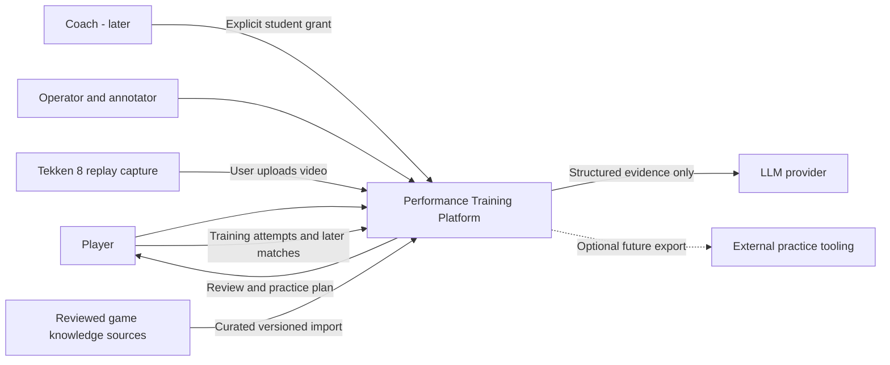
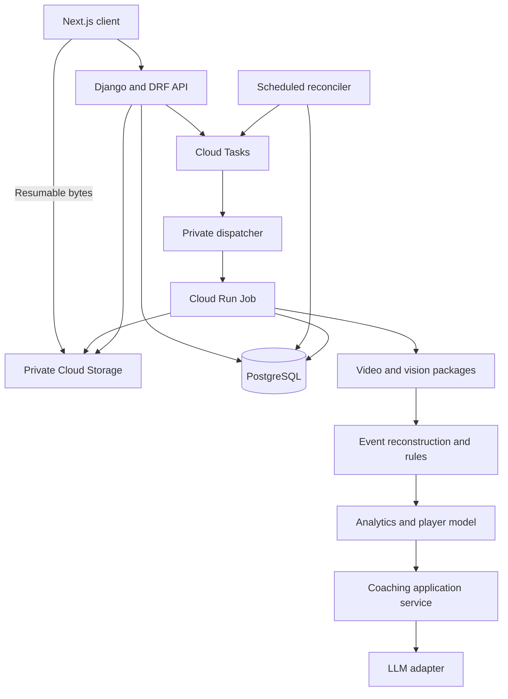
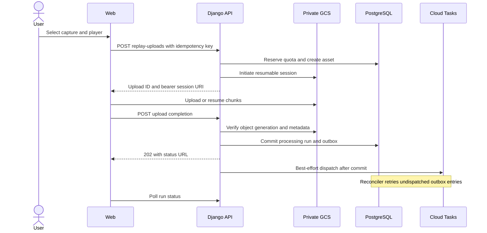
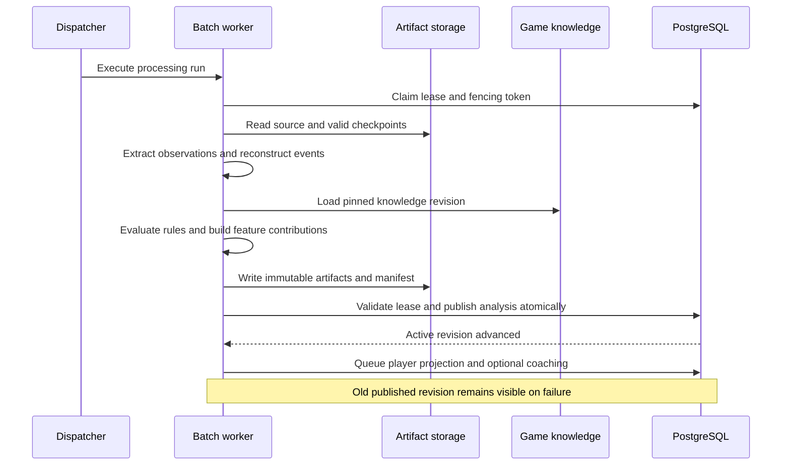
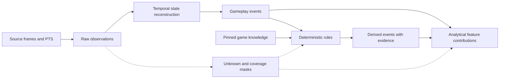
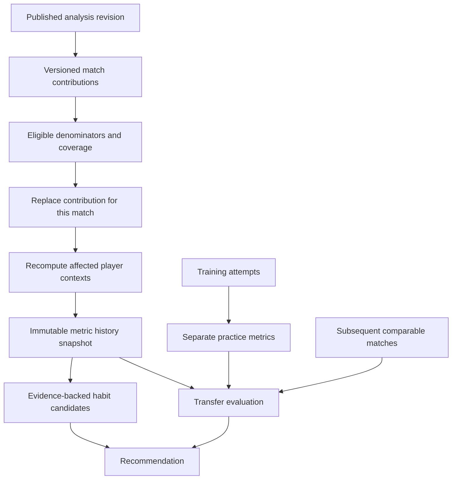
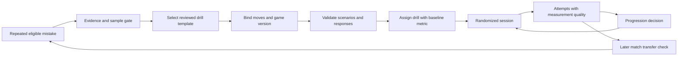
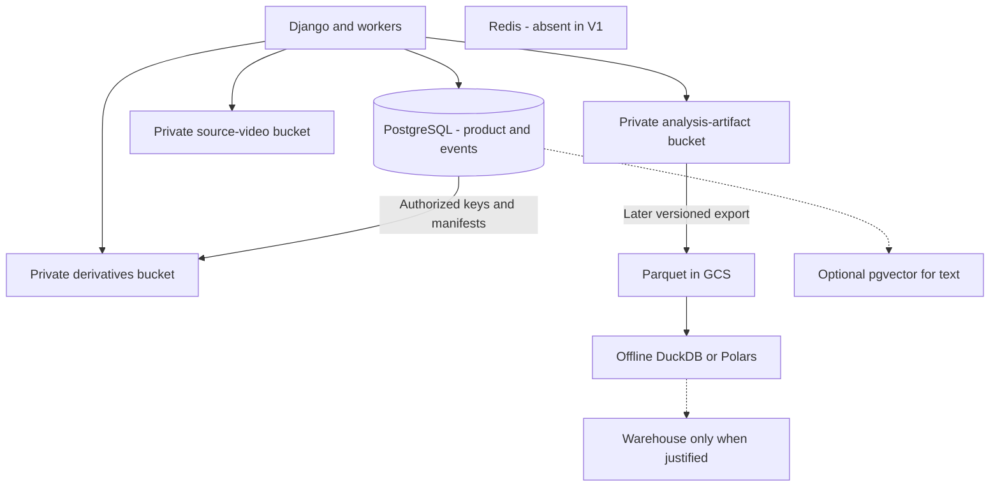
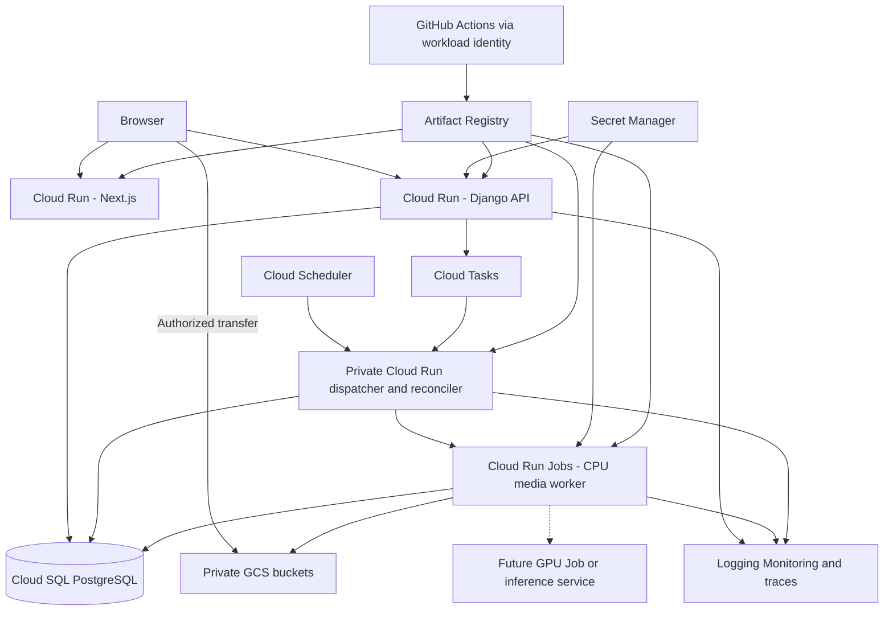
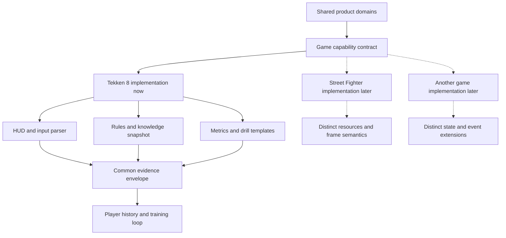

# Fighting-Game Performance Training Platform — Technical Architecture

> Historical V1 proposal. Superseded by [Architecture V2](architecture/architecture-v2.md)
> following the adversarial review on 18 September 2026. Retained for decision provenance;
> its M1–M7 sequence and initial 30-situation scope are not the implementation plan.

Design baseline: 18 September 2026. Status: proposed, subject to the validation gates in section 35. This document designs the system; it does not implement the application. All accuracy, latency, capacity, and experiment thresholds below are proposed targets, not measured results. Monetary estimates are USD.

## 1. Executive Summary

Build a Python-centered modular monolith: Django/DRF owns the product, PostgreSQL owns structured performance history, private Google Cloud Storage holds video and processing artifacts, and a separately deployed worker image runs the same Python domain packages in Cloud Run Jobs. Use Cloud Tasks for brief authenticated dispatch requests, with durable processing state and an outbox in PostgreSQL. Start without Redis, Celery, FastAPI, pgvector, a warehouse, or Kubernetes.

The first release should deliver reliable upload, asynchronous basic-state extraction, and synchronized replay playback. Move-level coaching is a gated expansion. Require a documented replay capture profile for advanced analysis: visible HUD, suitable resolution, original-speed footage, and validated input/frame overlays. Ordinary footage can receive basic analysis without pretending it supports exact move facts.

The hardest problem is observability, not choosing a neural network. An input is not necessarily an executed move; an unsafe move is not necessarily punishable at the observed range; a health change does not by itself establish hit type. The system must preserve these distinctions, report uncertainty, and abstain when evidence is insufficient.

The defensible asset is a versioned history connecting **observed situations → decisions → outcomes → prescribed practice → measured attempts → subsequent match behavior**. The LLM explains this evidence. It does not establish game facts, manufacture scores, or turn missing data into certainty.

Before building the SaaS workflow, run a bounded feasibility study using consented, manually annotated Tekken 8 footage. Validate HUD extraction, overlay timing, move identification, and punish eligibility for a narrow move set. If advanced extraction fails, ship basic replay indexing and human-confirmed coaching while improving detectors.

## 2. Key Architectural Decisions

| Decision | Recommendation and challenge |
|---|---|
| Application backend | Django/DRF: relational workflows, administration, permissions, and migrations dominate. FastAPI's inference ergonomics do not justify replacing this foundation. |
| Deployment boundary | API and batch workers deploy separately but share one repository, domain code, and database. Separate scaling does not require independent microservices. |
| Frontend | Next.js, TypeScript, React, Tailwind, TanStack Query. Keep business rules in Django. A Vite SPA is simpler if SSR and public content never matter; Next.js is acceptable given team preference. |
| Async execution | Cloud Tasks → short dispatcher → Cloud Run Jobs. PostgreSQL stores truth. A local CLI executes the identical pipeline without a broker. |
| Video understanding | HUD/overlay extraction first, limited temporal CV second. Full animation recognition is an experiment, not an MVP assumption. |
| Rules | Versioned deterministic Python rules over validated observations and curated game-data snapshots. Return established / contradicted / unknown with reasons. |
| Events | Conventional immutable revisioned event tables plus mutable product records. No full event sourcing. |
| Player model | Contextual counts, denominators, uncertainty intervals, and historical snapshots before predictive ML. |
| Storage | PostgreSQL + object storage. Dense observations are compressed objects, not millions of ORM rows. |
| Progress | REST polling with backoff. No persistent connection infrastructure in V1. |
| AI | One provider adapter, explicit schemas, verified evidence IDs, and deterministic fallback summaries. |
| Historical correctness | Pin game version separately from knowledge revision, detector versions, and metric definition versions. |

### Research informing the decisions

These are public architecture and repository observations, not production audits or endorsements. Reviewed repository layouts, documentation, and license declarations are linked below. Where internals were not established, no claim is made about them. No code was copied. Before any reuse, pin a commit and review that version's license and dependency notices; model weights and datasets need separate rights review.

| Reference | Relevant idea and lesson | Application here; what not to copy | License considerations |
|---|---|---|---|
| [OpenDojo](https://github.com/sirmammingtonham/opendojo) | Portable practice recordings with scenario metadata and frame-duration input events; repository separates DLL, cloud API, and research/docs. | Keep a declarative drill schema and an optional export adapter. Do not depend on its memory offsets, injected DLL, supported game build, or cloud deployment. Portable intent must survive a tool becoming unavailable. | Repository declares MIT. Dependencies, game interaction rights, and recording compatibility require separate checks. |
| [Awpy](https://github.com/pnxenopoulos/awpy) | Parses CS2 replay data into rounds, ticks, and event tables, with Polars output. Separates parsing from analytical use. | Borrow the observation/event/analytics boundary and round indexing. Its structured demo inputs do not demonstrate that Tekken video can expose the same information. | [MIT license](https://github.com/pnxenopoulos/awpy/blob/main/LICENSE); game assets/data are a separate matter. |
| [PySceneDetect](https://github.com/Breakthrough/PySceneDetect) | Python/OpenCV scene detectors, timecodes, splitting, benchmark and test directories. | Evaluate as an optional segmentation helper against a simple HUD state machine. Scene cuts are not round boundaries; camera effects may trigger false cuts. | BSD-3-Clause; FFmpeg dependencies have their own build-dependent terms. |
| [CVAT](https://github.com/cvat-ai/cvat) | Video annotation, review, SDKs, cloud storage integration; explicit backend/UI and deployment assets. | Use as an offline annotation tool if spreadsheets plus a video player become inadequate. Do not embed its full deployment or authorization system in the product. | MIT core; serverless assets, models, and dependencies can have different restrictions. |
| [FiftyOne](https://github.com/voxel51/fiftyone) | Dataset inspection and model evaluation workflows. | Useful later for error slices, uncertain examples, and regression review. Do not add another production datastore just to browse a small golden set. | Apache-2.0 repository; review bundled integrations and datasets separately. |
| [Immich architecture](https://docs.immich.app/developer/architecture/) | Media API, background processing, ML boundary, repository interfaces, generated API clients. | Apply storage/provider interfaces and independent heavy processing. Do not copy the entire photo platform, Redis requirement, or every container boundary. Documentation contains both target and implementation descriptions; it is not a deployment blueprint for this product. | [Repository declares AGPL-3.0](https://github.com/immich-app/immich). Treat as conceptual reference; obtain license review before reuse. |
| [Celery](https://github.com/celery/celery) | Mature Python task abstraction; broker delivery requires explicit task correctness. | A valid alternative for a VM deployment. Redis visibility timeout can cause redelivery; long media tasks still need idempotency and durable checkpoints. Do not introduce it alongside Cloud Tasks without a separate requirement. | New BSD declaration; broker licensing is separate. [Redis delivery caveats](https://docs.celeryq.dev/en/stable/getting-started/backends-and-brokers/redis.html). |

No verified public architecture found here establishes reliable, comprehensive Tekken 8 video-to-move inference. That remains a product-specific experiment. Public frame-data availability also does not establish permission to redistribute it or historical completeness.

## 3. Product Domain Model

The core aggregate is a player's performance history, composed of independently versioned records rather than one mutable JSON profile.

| Domain | Principal concepts | Invariant |
|---|---|---|
| Identity | User, PlayerProfile, ownership, explicit sharing grants | Upload ownership and in-game participant identity are different. |
| Game knowledge | Game, GameVersion, Character, Move, KnowledgeRevision | Every rule-dependent result pins the exact knowledge used. |
| Gameplay | ReplayAsset, Match, Participant, Round, ReplaySegment | One upload can contain many matches; one match can have several recordings. |
| Evidence | ObservationArtifact, GameplayEvent, DerivedEvent, EvidenceLink | Every conclusion can be traced to timestamps and evidence, including uncertainties. |
| Analysis | AnalysisRun, StageRun, MatchFeatureSet, DetectedHabit | Reprocessing never silently combines incompatible outputs. |
| Player model | PlayerStatistic, SkillMetricDefinition, SkillMetricHistory | Every rate has an eligible denominator and measurement context. |
| Training | Drill, DrillVersion, Scenario, Assignment, Session, Attempt | The prescribed version and actual attempt conditions are retained. |
| Coaching | Recommendation, CoachRelationship, CoachNote | Recommendations cite facts; sharing is explicit and revocable. |

A User may have one PlayerProfile initially; a profile can have many game/character contexts. A Participant may be linked to a profile only through explicit user confirmation or later validated account linking. Opponent names seen in a video do not create accounts or cross-upload identities. Maintain stable participant IDs through screen-side switches.

Distinguish a **recording timeline**, a **unique played match**, and a **viewing pass**. Replay rewinds, repeated rounds, slow motion, and replay takeover can otherwise double-count opportunities or mix practice with real match behavior. Mark practice/takeover as a separate segment type; exclude it from match statistics.

## 4. MVP Scope

Use two release boundaries: **M1 basic replay MVP**, then **M2–M7 closed-loop pilot**. The vision is not the release checklist.

| Product milestone | Scope and exit condition |
|---|---|
| M1 | Upload, validation, asynchronous processing, characters with confirmation, match/round boundaries, timer/health estimates, timestamped playback. Meets basic-state quality and recovery tests. |
| M2 | Add separately evaluated event classes: attacks, hits/blocks, throws, launches, combos, Heat and wall cues. Store candidate punishment situations only until M3 can validate them. Each class has its own release flag. |
| M3 | Curated versioned move catalog and deterministic rules for a narrow supported move set. Established punish outcomes require the validation gate. This dependency must be built before public M2 punish claims. |
| M4 | Contextual rates, move usage, conditional follow-ups, coverage and confidence intervals. No global skill score. |
| M5 | Evidence-based coaching with three or fewer actionable priorities and timestamp links. |
| M6 | Mistake-to-drill templates, manual in-game instructions and browser exercises. No required mod. |
| M7 | Attempt measurements, progression, subsequent-match comparison, and retention checks. Distinguish self-report from verified measurement. |

Initial advanced support should cover two selected characters and approximately 30 high-value move situations, chosen from validation footage and data rights. Basic HUD support can cover more characters through confirmed labels. Expansion requires measured coverage, not just adding character names.

Outside V1: live coaching, game-process access, anti-cheat-risk integrations, all games, social network, coach marketplace, creator studio, scouting, foundation-model training, perfect animation recognition, Kafka, Spark, and Kubernetes. Billing can begin as manually assigned quotas; no custom subscription platform before willingness to pay is tested.

### Initial non-functional targets

| Area | Target and measurement conditions |
|---|---|
| API | Warm p95 <300 ms for ordinary reads/writes, excluding signed-object transfer and external providers; p99 <1 s. Measure end-to-end regional API latency and server time separately. |
| Upload | Up to 2 GiB and 20 minutes per asset in pilot; direct resumable upload. Advanced profile: 1080p, nominal 60 fps, readable overlays. 720p/30 fps may qualify for basic state only. |
| Processing | For a supported 10-minute capture: p50 ≤5 min, p95 ≤15 min from validated upload to basic analysis under admission limits; validate on 2 vCPU/4 GiB. |
| Queue/progress | Dispatch p95 <60 s under planned capacity; heartbeat every 15 s; stage progress at least every 30 s. Saturation shows queued status and revised ETA. |
| Availability | Pilot internal objective 99.5% monthly API availability; no contractual SLA. Separate analysis completion target ≥98% of supported, valid uploads within 24 h. |
| Recovery | Production pilot DB RPO ≤24 h and RTO ≤8 h with tested daily backups; enable PITR and target RPO ≤15 min/RTO ≤4 h before paid reliability commitments. |
| Analytics | Precomputed profile read p95 <500 ms; indexed replay search p95 <1 s for 10,000 matches per owner on a representative load test. |
| Growth | Budget 0.5–2 MiB relational data per 10-minute match initially, measured including indexes; dense frame records live in objects. |
| Confidence | Class-specific calibrated thresholds, precision/coverage gates, and explicit unknown values; never a single global confidence cutoff. |
| Security | Private objects, authorization before each URL issue, signed downloads expire in 5 min; no public media by default. |

## 5. Future Capability Map

| Capability | Existing foundation to reuse | Additional work and release dependency |
|---|---|---|
| Replay/match analysis | Evidence pipeline, events, versions | Broaden game/capture coverage only after detector evaluation. |
| Personal AI coach | Player snapshots and recommendation evidence | Provider adapter and approved coaching content after M4. |
| Automatic drills | Habits, rule-validated templates | Versioned scenarios, assignments and attempts after M5. |
| Mechanics lab | Session/attempt schema | Purpose-specific measurement: browser recognition tasks first; controller timing or game execution requires a validated capture/input integration. |
| Replay search | Typed events, timestamp indexes | Query compiler and on-demand clips; semantic text retrieval only where needed. |
| Skill passport | Definitions, raw rates, confidence, history | Calibrated benchmark cohorts before normalized scores. |
| Adaptive combo lab | ComboVersion and verified attempts | Expected damage/position/resource utility conditional on context and drop outcome. |
| Personal patch impact | Immutable knowledge versions and move usage | Rank changed moves by usage × change relevance; historical facts remain on their original patch. |
| Puzzles | Evidence clips and rule validators | Curated answer sets, ambiguous-answer handling, puzzle attempts; no claim of unique optimal choice without proof. |
| Smart sparring | Profiles and learning goals | Independent future matching module: mutual opt-in, region/latency, platform, rank, characters and FT5/FT10 preference. |
| Coach OS | Explicit grants, notes, assignments | Multi-student dashboards, reports and homework; owner data remains segregated. |
| Creator tools | Asset variants and event-linked clips | Separate consent, redaction and export workflow; no influence on core detector priorities. |

## 6. System Context Diagram



The platform does not connect to a running game in V1. Capture instructions and uploaded video form the integration boundary.

## 7. Component Architecture



Dispatcher and API use the same Django codebase but separate Cloud Run service identities. Jobs use the same domain package with a heavier media image. Pure rules and metric calculations have no Django, HTTP, or model-provider dependency. Workers call application services locally; no HTTP hop to the API is needed for every event.

A recommendation failure must not fail video processing. Publish core analysis before scheduling optional coaching. The scheduler/reconciler is a short invocation of the same application code, not a new orchestration service.

## 8. Recommended Repository Structure

Conceptual layout; create only packages needed by the current milestone.

```text
/
  frontend/                    # Next.js UI; generated API types
  backend/
    pyproject.toml
    config/                    # Django settings and URLs
    apps/
      accounts/
      games/                   # patches and curated knowledge included
      matches/                 # replay ownership and participants
      analysis/                # runs, publication, statistics, player model
      training/                # introduced at M6
      coaching/                # introduced at M5
    domain/
      events/                  # typed envelopes and schemas
      rules/                   # pure rule interfaces
      metrics/                 # eligibility and aggregation
      games/tekken8/           # concrete knowledge and semantics
    processing/
      video/
      vision/
      reconstruction/
      pipeline/
    adapters/                  # GCS, task dispatch, LLM provider
    entrypoints/               # API bootstrap, run_job, reconcile
  evaluation/
    manifests/                 # fixture hashes and consent references
    annotations/               # small non-sensitive metadata only
    experiments/               # extraction and statistical notebooks
  tests/
    unit/ integration/ pipeline/ contracts/ e2e/
  infrastructure/              # Docker; small Terraform deployment later
  docs/
    architecture.md
```

Avoid top-level `workers/`, `ml/`, and `backend/` implementations of the same rules. A worker is initially an entrypoint, not a competing application. Add a dedicated model-training package when a real training loop exists. Video fixtures live in controlled object storage, referenced by manifests rather than committed to Git.

Lock Python and JavaScript dependencies; generate the TypeScript client from the DRF OpenAPI contract. Use Ruff, type checking, pytest, and a small set of import-boundary checks. Prefer `commands/publish_analysis.py` and `queries/player_history.py` to a growing catch-all `services.py`.

## 9. Django Domain Boundaries

| Module | Owns | Exposes | Must not own |
|---|---|---|---|
| accounts | User, profile, consent, grants | Owner/grant policy checks | Video interpretation |
| games | Game releases, characters, move knowledge, import review | Immutable knowledge lookup | Player statistics |
| matches | Upload records, assets, match segments, participants, rounds | Authorized match and asset queries | CV model internals |
| analysis | Runs, publication manifests, events, features, player projections | Start/cancel analysis, evidence queries, metrics | Provider-specific LLM calls |
| coaching | Recommendation lifecycle, prompts, evidence bundles, later coach notes | Explain/assign actions | Fundamental game facts |
| training | Drill versions, assignments, sessions, attempts, progression | Start/record/evaluate practice | Assumed access to game memory |
| billing, later | Entitlements, quota ledger, payment events | Reserve/settle usage | Analysis correctness |

For M1, accounts, games, matches and analysis suffice. Skills and player statistics can be subpackages of analysis until ownership or complexity justifies apps. Patches belong in games. Django models enforce structural constraints; application commands own transactions and permissions; domain functions own rules; views only validate, authorize, call, and serialize.

Cross-module foreign keys are acceptable within one database. Cross-module writes go through named commands. Read projections can join tables; do not invent service RPCs to enforce conceptual boundaries. Use an outbox only for work crossing a transaction/process boundary, not for every function call.

## 10. Video Processing Pipeline

### Capture and upload contract

Begin with SDR H.264 MP4 captures; explicitly test additional container/codec combinations before supporting them. Browser MIME declarations are not trusted. Require uncut normal-speed gameplay for advanced analysis; detect and label pauses, rewinds and discontinuities. Preserve the source for analysis at original spatial and temporal resolution within retention. A compressed playback proxy is a separate derivative.

Create the replay asset before upload, not a definitive Match. Match boundaries are not yet known. Client supplies game hint, declared capture date/version, selected player side, and overlay profile. Server creates an owner-scoped random object key, upload quota reservation and expiring upload record.

Use a GCS resumable session initiated by the backend and transmitted over TLS. Its session URI is a bearer credential; do not log it. A signed initiation URL is an alternative when geographic initiation matters. Signed URLs are not required for each resumable chunk. Restrict browser origins; the client resumes with offset queries after disconnects. Server validates final object generation, checksums and actual size before accepting it. [GCS resumable upload documentation](https://docs.cloud.google.com/storage/docs/resumable-uploads).



### Stage contracts

| Stage | Input → output | Failure boundary |
|---|---|---|
| Probe | Object generation → codec, duration, PTS metadata, stream inventory | Reject corrupt/unbounded inputs; sandbox FFmpeg. |
| Quality/profile | Probe + samples → HUD layout, readable regions, coverage mask | Unsupported advanced profile can still receive basic output. |
| Playback preparation | Source → fast-start MP4 proxy, thumbnail, time mapping | May complete independently of move analysis. |
| Segmentation | HUD/timer/reset cues → matches, rounds, passes, discontinuities | Publish uncertain boundaries for correction. |
| Observation extraction | Source frame regions → health/timer/input/resource observations | Checkpoint chunk outputs; unknown when obscured. |
| Reconstruction | Time-indexed observations → states and game-event candidates | Resolve temporal consistency, retain alternatives. |
| Rules | Candidates + patch knowledge → established/unknown derived events | Missing knowledge disables only dependent conclusions. |
| Features | Published event revision → match contributions | Atomic contribution replacement on reanalysis. |
| Player projection | Contributions → contextual statistics/history | Serialized publication per player and definition. |
| Coaching | Published evidence bundle → validated recommendation | Optional; deterministic summary on failure. |

Stream frames through the decoder; do not write every frame as JPEG. Sample HUD at 5–10 Hz for coarse trends; inspect candidate transitions and command-history regions at native capture rate for timing-sensitive events. At low capture frame rates, retain timing uncertainty and disable exact-frame claims. Chunk extraction into roughly 30–60 s intervals with overlap; assign events to one core interval and reconcile boundaries to prevent duplicate or truncated combos.



Processing status has `queued`, `running`, `partial`, `succeeded`, `failed`, `cancel_requested`, `cancelled`, and `deleting` states. Stage status is separate. Report completed work units and capabilities, not a fabricated smooth percentage. Cancellation stops at safe chunk boundaries and uses the execution cancel API when necessary; already consumed compute remains consumed.

Hash the full source bytes while reading; never trust a client hash for cross-owner reuse. Exact duplicate uploads within an owner can reuse extraction artifacts after authorization and generation checks. Re-encoded duplicates require user confirmation or robust match identity evidence; do not silently merge them. Exclude confirmed duplicate matches from denominators. No cross-user duplicate-existence disclosure or global private-video deduplication in V1.

## 11. Computer Vision Architecture

| Approach | Strength | Limitation | Decision |
|---|---|---|---|
| A: pure gameplay CV | Lowest capture friction | Large move vocabulary, customization, occlusion, perspective and timing ambiguity | Basic HUD first; limited animation classifiers later. |
| B: overlays | Constrains input/timing/move candidates | Requires readable captures; inputs can be buffered, ignored, repeated or stance dependent | Primary advanced pilot input, subject to experiment. |
| C: hybrid | Combines input candidates, HUD and temporal action evidence | More fusion logic; correlated errors remain | Recommended phased target. |

Use a versioned `CaptureProfile` containing resolution/layout ranges, language, HUD template, crop rules, overlay requirements, expected playback mode and calibration procedure. Determine capability per segment, not per upload: `basic_state`, `input_history`, `move_identity`, `hit_state`, `punish_eligibility`, `wall_context`.

Extraction order: normalized HUD anchor matching → color/geometry health bars → constrained timer OCR → character portrait candidates → input glyph detection → temporal de-duplication of scrolling history → stance-aware move candidates → hit/block cues and timing fusion. Compare a small classifier against deterministic templates before adopting it. Health should initially be a ratio with error bounds; recoverable health is separate. Convert to points only when the relevant health definition is known.

Store per-field uncertainty, missingness, bounding region, source time and detector revision. Health transitions must account for chip/recoverable health, regeneration, resets and effects; a bar decrease alone is not exact move damage. Likewise, no input does not prove blocking, and a visible attack missing does not prove the player intended a whiff punish.

Input-to-move mapping uses character, stance, facing, prior string state, charge/hold duration, movement and temporal alignment. Keep the candidate set when ambiguous. Player-relative directions differ from absolute screen directions, especially after side switches. Throw-break input identification requires observable attempts and throw-specific rules; no universal timing assumption.

Wall position is categorical with uncertainty in V1 (`unknown`, `near`, `contact_confirmed`); do not report invented world distance such as 1.25. Camera zoom and perspective invalidate simple screen-pixel distance. Frame advantage from an overlay is an observation that must be reconciled with context and patch data, not automatically treated as truth.

Introduce PyTorch for a demonstrated classifier gap, not by default. YOLO/RT-DETR are candidates for variable-position region detection, small CNNs for glyphs, temporal classifiers for a constrained action set. ViT/VideoMAE require stronger evidence of benefit and enough labeled sequences. Transformers, scikit-learn and XGBoost are optional dependencies, not startup requirements.

## 12. Deterministic Game Engine

This is a **partial knowledge and rules engine**, not a complete Tekken simulator. Implement pure functions over typed event/state inputs. Rules receive a `KnowledgeRevision`, explicit preconditions and evidence quality. Each result contains `established`, `contradicted`, or `unknown`, reason codes, evidence IDs, applicable move variants and rule version.

Core knowledge includes stable move identity; command aliases; stance transitions; startup and active-frame ranges; hit-level and multi-hit components; block/hit/counter-hit outcomes; damage formula parameters; tracking/homing/power-crush and Heat properties; character state and conditional modifiers. Use typed predicates for reviewed conditional variants, not arbitrary code strings executed from the database. Unmodeled behavior remains unknown.

For block punishment, first establish the blocked move/variant and a valid response window. Then evaluate the player's available response, stance, reach/alignment, pushback, movement/transition costs, string continuation, resource conditions and contact timing. Startup ≤ disadvantage is a necessary simplification in many cases, not a complete proof of punishability. Validate frame-index conventions against curated boundary fixtures; never subtract video frame indices as if they were game simulation frames.

Separate four facts:

1. **Frame-unsafe candidate:** knowledge says a move variant can leave disadvantage in this context.
2. **Confirmed eligible opportunity:** a validated response could connect before recovery under established conditions.
3. **Successful punish:** observed response/contact satisfies the rule or a validated game indicator establishes it.
4. **Missed punish:** an eligible opportunity is confirmed, the entire response window is observable, and no qualifying punish occurred.

Unknown range or response-window coverage blocks a missed-punish judgment. Choosing a small confirmed punish may count as success while yielding a separate conservative damage-efficiency metric. Attacking while negative is a tendency; calling it a mistake additionally requires contextual outcome evidence. Evasion, armored moves, spacing and opponent options prevent simplistic “minus means always block” advice.

For whiff punishment, require a confirmed whiff, recovery opportunity and qualifying response; otherwise label `attack_after_opponent_whiff`. For combos, separate observed damage sequences from a **drop**, which requires an intended route or curated valid continuation. Do not diagnose intentional resets as drops. Exact theoretical damage needs patch-specific scaling, resource, wall, floor and recovery rules; observed health deltas remain a different measurement.

### Temporal knowledge

`GameVersion` identifies a playable build/rules release. `Patch` identifies a documented change publication, potentially affecting several platform builds. `KnowledgeRevision` is an immutable curated snapshot for one GameVersion. Correcting a data error creates a new knowledge revision without pretending the game changed.

A snapshot maps stable Move IDs to immutable MoveVersions and FrameData variants. Reuse unchanged immutable rows across snapshots; use an explicit mapping so no lookup falls back to “latest.” Preserve source reference, imported hash, review state and reviewer. Character availability and stance definitions are versioned too. A match stores patch identification status and evidence; an analysis pins the accepted GameVersion and KnowledgeRevision. Unknown patch permits HUD results but blocks patch-dependent advice.

Do not infer a game's build from upload date. Capture date and user selection are hints that can conflict. Correcting match metadata creates a revision and a new analysis. Historical footage remains useful even if native replay playback disappears: Bandai Namco's April 2025 patch notice explicitly made previous replay data unplayable/deleted online. [Official patch notice](https://en.bandainamcoent.eu/tekken/news/tekken-8-patch-20).

## 13. Gameplay Event Model



| Layer | Example | Representation |
|---|---|---|
| Raw observation | OCR token, health ratio, input glyph, animation candidate | Compressed chunk objects plus searchable artifact manifest. |
| Gameplay event | `move_started`, `move_blocked`, `throw_attempted`, `heat_activated` | Typed event envelope; can be uncertain. |
| Derived event | `missed_punish`, `unsafe_challenge`, `failed_throw_break` | Separate logical layer with rule result and evidence links. |
| Feature | Eligible opportunities, successes, context/action counts | Versioned per-match contribution rows and aggregates. |

Use conventional tables with immutable revisions. This is not event sourcing for accounts, billing, or the whole application. Corrections publish a new event set or an annotation that triggers a new revision; do not mutate old facts in place. Immutability does not override deletion obligations.

Example schema envelope; identifiers and values below are illustrative, not a claim about any named Tekken move:

```json
{
  "schema_version": "event/1",
  "event_id": "evt_example_01",
  "owner_id": "owner_01",
  "match_id": "match_01",
  "round_id": "round_03",
  "analysis_run_id": "run_02",
  "layer": "derived",
  "type": "missed_punish",
  "actor_participant_id": "participant_1",
  "target_participant_id": "participant_2",
  "time": {
    "asset_id": "asset_01",
    "segment_id": "segment_01",
    "start_pts": 7579170,
    "end_pts": 7601670,
    "time_base_num": 1,
    "time_base_den": 90000,
    "source_frame_index": 5053,
    "game_frame_index": null,
    "uncertainty_ms": 34
  },
  "context": {
    "screen_side": "left",
    "facing": "right",
    "stance": "standing",
    "wall_state": "unknown",
    "distance_world_units": null
  },
  "result": {
    "status": "established",
    "move_version_id": "move_variant_example",
    "eligible_response_ids": ["response_example"],
    "reason_codes": ["WINDOW_FULLY_OBSERVED", "RESPONSE_VALIDATED"]
  },
  "quality": {
    "calibrated_confidence": 0.99,
    "calibration_version": "punish-calibration/1",
    "coverage": "complete_response_window"
  },
  "evidence_ids": ["event_block_01", "observation_span_17"],
  "provenance_manifest_id": "manifest_02"
}
```

The provenance manifest resolves pipeline, individual detector, model/weights, rules, frame-data/knowledge, game patch, analysis and calibration versions; configuration hash; container digest; artifact generations; and input hashes. A heuristic detector without calibration uses `calibrated_confidence: null` plus quality flags, not a made-up probability. Deterministic rule execution does not raise uncertain perception to certainty. Calibrate composite conclusions on held-out examples; do not multiply correlated confidence scores.

Canonical media time is integer presentation timestamp plus rational time base. Store source decode frame index for navigation, but game-frame index is nullable and only populated from a validated alignment. A segment maps source time to normalized playback time, including cuts/speed changes. Derived playback timestamps never replace source timestamps. Wall clock `played_at`, `captured_at`, `uploaded_at` and processing time are distinct.

Promote common filter fields—type, layer, participants, round, move version, start time, confidence status—to columns. Validate versioned JSONB payloads for game-specific details. Use an evidence edge table for relational event links and artifact span references for dense observations. Unknown is not zero, false, or “other.”

## 14. Player Model

The player model is a collection of inspectable conditional distributions, rates, histories and evidence, not an LLM memory paragraph or a learned vector. Initial context keys are game version family, own character, opponent character, situation, side and metric definition. Add finer dimensions only when samples support them.

Define a decision opportunity by its trigger, observable response window, first actionable time where known, terminal condition, and mutually exclusive action taxonomy. Example: after a confirmed move hits, record the first committed action before the opponent acts or the versioned response window ends. Distinguish `no_committed_action`, `unknown_action`, and `unobserved_window`. Define blocking only where evidence supports it. This prevents an arbitrary 500 ms window from counting both a jab and a later backdash as one decision.

For a supported context `s`, estimate `P(action=a | s, eligible capture)`. Retain raw counts and excluded/unknown counts. A Dirichlet prior with declared weak pseudocounts can stabilize small categorical distributions; binary rates use a Beta(1,1) baseline posterior. Show observed `k/n` beside a 95% interval and any posterior estimate. The prior is an analytical choice, not evidence of player ability.

Example: 31 WS2 choices out of 50 eligible, recognized follow-ups gives an observed 62%; a rough binomial interval is about 48–74%. That distribution alone does not demonstrate harmful predictability. Evaluate contextual outcome differences, opponent adaptation and repeated exploitation, with uncertainty and selection bias disclosed. User-provided move examples are illustrative until their actual game semantics are validated.

Proposed display gates: below 20 eligible opportunities, show counts only; 20–49, exploratory tendency; ≥50 across at least 5 matches and 3 sessions, consider a recommendation if coverage and effect size justify it. Rare events need wider uncertainty, not forced conclusions. Treat repeated actions in one set as correlated: use session/block bootstrap for recommendation intervals or a hierarchical model once data supports it. A simple independent-event posterior is only a descriptive starting point.

Maintain both fixed windows (last 30 days/last 50 matches) and lifetime counts. Optional recency weighting uses a declared half-life, such as 30 days. Report effective sample size `(sum w)^2 / sum(w^2)` separately from actual sample count; do not present weighted pseudo-counts as independent trials. Rank and opponent strength are match-time snapshots, not current profile attributes. Split patch eras when relevant mechanics change; only pool through a reviewed compatibility mapping.

Context progression: own character + trigger first; then opponent character; then side/rank/resource/wall state. Use explicit fallback to broader context with a label, rather than thousands of empty buckets. Session fatigue and adaptation require within-session measurements and controls for opponent difficulty. Opponent archetypes and clustering are later hypotheses requiring stable labels; usernames must not substitute for verified opponent identity.



A reanalysis replaces that match's active contribution atomically; it must not add the same events again. Maintain `PlayerProjectionRevision` with the selected match-analysis IDs, metric versions and cutoff. Read profile charts from one published revision. If a job crashes between event publication and projection, show the previous coherent player model with an “updating” marker.

## 15. Analytics Architecture

Begin with SQL aggregation and explicit per-match contribution tables. Precompute expensive player summaries after publication; cheap filtered counts can be read on demand. Avoid repeated full-history scans during polling. Use integer numerator/denominator counts for rates; keep distribution bins and supported outcome sums. Recompute quantiles from retained attempt samples or a clearly versioned approximation, not by averaging per-match medians.

| Tool | Introduce when | Avoid using it for |
|---|---|---|
| PostgreSQL/SQL | V1: owner-scoped event filters, contribution aggregation and histories | Dense frame-by-frame storage or unbounded dashboards. |
| Polars | Offline evaluation or exports no longer fit simple SQL/standard Python comfortably | A second authoritative metric implementation. |
| Parquet + DuckDB | Repeated scans of ~10–50 million events, exports above ~10–50 GiB, or OLTP interference despite indexes/preaggregation | Serving every transactional API call. |
| Statistical models | Need partial pooling, session effects or adjusted trend estimates | Claiming causal benefit from observational correlations. |
| XGBoost | Enough labeled, held-out tabular outcomes and demonstrated improvement over transparent baselines | Creating arbitrary skill scores from rank proxies. |
| Clustering | Sufficient stable behavior data to test useful opponent/player archetypes | Automatically labeling people from tiny samples. |
| PyTorch | A justified perception/sequence-learning task with evaluation data | Simple conditional probability tables. |
| Warehouse | Multiple analysts and recurring joins across roughly 0.5–1 TB, or sustained scan concurrency causes contention | A prerequisite for 1,000 users. |

Thresholds are investigation triggers, not platform limits. Query plans, I/O, maintenance time, concurrency and cost decide migration. Exports are immutable, partitioned by game, date and analysis revision, with a manifest selecting active revisions and deletion status. Avoid files per event or tiny partitions per user. Delete/rewrite affected export partitions when removing a user's data.

### Product effectiveness

Store a small versioned ProductEvent vocabulary: `upload_completed`, `analysis_published`, `analysis_viewed`, `recommendation_accepted`, `drill_started`, `drill_completed`, `subsequent_match_analyzed`. Use server events for completion and deduplicated client events for views. Properties contain internal IDs, not video content, prompts or opponent names.

Measure supported-upload completion rate; time to first useful analysis; proportion of viewers who choose a recommendation; assigned-to-started and started-to-completed drill rates; return with analyzable matches within 7/30 days; and target-weakness change per eligible opportunity. Report funnel denominators and cohort dates. Weekly match uploads indicate use but do not prove improvement. Voluntary rank progression and coach engagement are secondary context.

For training transfer, define target metric and comparison windows when the drill is assigned. Compare new matches with a compatible patch, character and similar matchup mix, requiring sufficient eligible opportunities and stable detector coverage. Use uncertainty intervals and disclose regression to the mean, practice self-selection and rank changes. Later randomize drill timing or use an opt-in waitlist design; an observational before/after gain is not proof of causality. Show retention at approximately 7 and 30 days, not only immediate practice improvement.

## 16. Drill Engine

Drills are versioned data interpreted by a small deterministic executor/validator. `Drill` provides identity; `DrillVersion` fixes scenarios, prerequisite game versions, instructions, response alternatives, success predicates, allowed randomization, measurement mode and adaptation policy. Assignments pin a version and the originating evidence/metric target. Editing a template cannot change an ongoing session.



Illustrative declarative contract:

```yaml
schema: drill/1
version_id: drill_version_example
game_version_id: verified_build_id
mode: manual_in_game
target_metric: punish_success/v1
scenario_selection:
  algorithm: balanced_shuffle/v1
  seed: session_assigned
scenarios:
  - id: blocked_move_a
    setup: {player_stance: standing, side: left, spacing: validated_setup_a}
    actions:
      - {actor: opponent, move_version_id: reviewed_move_a}
    success:
      validator: approved_response/v1
      allowed_response_ids: [reviewed_response_a]
      unknown_if: [unobserved_contact, incompatible_patch]
measurement: self_report
progression_policy: accuracy_and_coverage/v1
```

`DrillScenario` rows hold queryable metadata and ordered action/condition JSON validated against a schema. Do not create a generic arbitrary-code rules DSL or a table per predicate initially. The server can randomize browser tasks; for manual in-game randomization, provide explicit practice-slot setup instructions and record whether random playback was actually used. A session seed does not prove that a user followed it.

Progression example: start with two balanced options; require ≥40 verified attempts across two blocks, ≥90% observed success and a 95% Wilson lower bound above 75%; then add a third option. Require minimum attempts per option to prevent majority-class guessing. If a later block has <70% success, reduce complexity. Cooldowns and separate thresholds prevent oscillation. Vary timing/side only where supported. These are pilot policies to validate, not universal learning laws.

Record invalid/aborted attempts separately; exclude them from success denominators but display their rates. Preserve difficulty, scenario, side, timing, observation mode, device/capture profile and confidence for every attempt. Self-reported practice produces completion/adherence signals; it cannot certify execution proficiency. Browser response latency includes display/input/browser effects. Game footage timings include capture uncertainty. Neither is automatically a physiological reaction-time measurement.

For mechanics, create distinct validators: electric recognition/execution, backdash input sequence, movement displacement, iWR execution, punish response, hit confirm and throw recognition. Input sequence correctness and actual in-game outcome are separate. Sample fatigue as change across time blocks only after accounting for increasing difficulty and side changes.

For adaptive combos, store route, start situation, resource costs, side swap and wall carry categories in immutable `ComboVersion`. Expected damage is `p_complete × D_complete + (1-p_complete) × E[D_drop]`, not just completion × max damage. The user's 81×54%=43.74 and 76×94%=71.44 are only simplified zero-drop-damage illustrations. Add position/resource utility only with declared weights and sensitivity analysis; recommend a Pareto set when preferences are unknown. Track actual damage on failed attempts and confidence in completion estimates.

Optional future adapters translate supported drill intent to practice tooling. Store adapter version, supported game build, exported artifact and loss-of-fidelity warnings. A manual or video-based fallback always remains available. No process injection or automated online play is part of this design.

## 17. Skill Metric Architecture

`SkillMetricDefinition` is immutable and specifies event requirements, eligibility, exclusion reasons, numerator, denominator, aggregation, unit, confidence method, minimum sample, context dimensions, benchmark revision and patch compatibility. `SkillMetric` is the current published projection; `SkillMetricHistory` stores versioned snapshots. Keep raw rates even when a presentation score is later introduced.

| Metric | Definition | Pilot sample/context gate | Important exclusions |
|---|---|---|---|
| Punishment accuracy | Confirmed successful punishes / confirmed eligible punish windows | 30 opportunities across ≥5 matches; own character, matchup, patch | Unknown reach, missing response window, unsupported move rules. |
| Throw defense | Confirmed breaks / eligible observed breakable throws, stratified by required break type | 30 total; show individual types only at ≥10 each, with wide intervals | Unbreakable/context-exempt throws, unknown breakability, obscured result. |
| Challenge while negative | First committed attacks / observable decisions in a validated negative state | 50 contexts across ≥3 sessions | Unknown recovery alignment; no normative score without contextual evaluation. |
| Follow-up distribution | Recognized first actions / eligible trigger windows, plus unknown counts | 50 triggers for recommendations | Mixed window definitions, repeated replay passes. |
| Combo completion | Validated route completions / observed starts of that declared route | 30 starts per route/side | Unknown intended route in match footage; deliberate reset. |
| Wall damage received | Observed attributable damage / observed time or rounds in confirmed wall-defense state | 20 episodes; publish denominator unit | Unknown wall state, health transitions that cannot be attributed. |
| Execution success | Validated in-game successes / valid attempts of a specific mechanic | 40 verified attempts per side | Self-report or input-only evidence cannot claim outcome success. |
| Response latency | Median/p90 stimulus-to-valid-response latency with uncertainty | 40 valid responses, same measurement mode/device class | Unknown stimulus onset; do not mix video and browser timing. |

These gates authorize display, not statistical certainty. Every metric response includes timeframe, n, session count, excluded count, coverage, interval, definition version, patch, character/side context, and source-analysis watermark. Sampling confidence and detector reliability are separate fields.

Do not average 1, 2 and 1+2 throw break rates without declaring weights. The player's experienced throw mixture describes current performance; a fixed published reference mixture supports comparisons across time. Report both when sample sizes permit. Opponent rank and mix are confounders, not magic adjustments.

No 0–100 passport until a sufficiently large, consented, relevant benchmark cohort exists. A later score can be a documented percentile within patch/character/rank strata with shrinkage and uncertainty; publish cohort size, window, inclusion criteria and benchmark version. Do not compare percentiles from different cohorts as if they were absolute improvement. Movement, adaptation and matchup knowledge remain unscored until their constructs have validated definitions.

## 18. Replay Search Architecture

V1 supports explicit filters and event timelines. Use owner-scoped indexed SQL over event types, participants, game version, character, outcome and time. Store health ratios as queryable contextual fields when valid. A life lead of “60%” must be defined as 0.60 of maximum health difference, not a 60% relative ratio to the opponent; display the interpretation.

Natural language later compiles to a restricted typed query AST, never executable SQL. The server applies authorization separately, validates game vocabulary, caps time range/result size, and translates the AST into ORM/parameterized SQL. Ambiguous terms produce an editable interpretation chip or clarification; the model cannot override owner filters.

```json
{
  "schema": "replay-query/1",
  "game": "tekken8",
  "filters": [
    {"field": "opponent_character", "op": "eq", "value": "bryan"},
    {"field": "event_type", "op": "eq", "value": "missed_punish"},
    {"field": "health_lead_fraction", "op": "gt", "value": 0.5}
  ],
  "minimum_evidence": "established",
  "limit": 50
}
```

“Launched after SS2” requires a versioned sequence definition and first/next action boundaries. “Failed Giant Swing” may mean a broken throw or failed execution; distinguish them. “Lost after a large lead” uses round maximum health lead and final result. “Why Bryan?” invokes player analytics and evidence retrieval rather than embedding similarity alone.

Return evidence spans and playback offsets. Generate clips on demand from an authorized source with a hash of asset generation, time interval and encoding profile; reuse only within authorized ownership. Snapping to keyframes may change exact clip boundaries, so retain the event offset and use re-encoding when exact start is needed. Expired video leaves structured history searchable with `media_unavailable`.

Use PostgreSQL full-text search for notes and curated concepts before embeddings. Add pgvector only when semantic retrieval over a meaningful corpus of coaching documents/notes proves better than keywords in an evaluation set. Embeddings carry owner/access scope, document revision and deletion lineage. Do not embed every frame or numeric event. Tenant filtering must be applied before returning results; benchmark vector-search recall under selective filters.

## 19. AI / LLM Architecture

The deterministic layer selects eligible weaknesses, evidence and reviewed drill candidates. The LLM can explain tradeoffs and prioritize among those candidates using declared user goals; it cannot invent a candidate's measurements or game validity. Generic retrieval is secondary to the player's structured history.

`CoachProvider.generate(EvidenceBundle, OutputSchema, PolicyVersion) -> CoachDraft` is the single provider port. One implementation is enough initially. Record model identifier, prompt/schema version, input evidence hash, token usage, cost and provider response ID. Keep API keys in Secret Manager. Configure a per-request budget, timeout and retry limit.

An EvidenceBundle contains player-approved goals, metric values with denominators/intervals, context and coverage, reviewed rule conclusions, clip references and applicable drill templates. It excludes raw usernames and unnecessary video/audio. Retrieval documents are versioned by game patch, source and rights status; never retrieve a generic “latest move” fact for historical analysis.

Structured output includes `summary`, `priorities[{candidate_id, rationale, evidence_ids, drill_template_id}]`, `uncertainties` and optional questions. Validate identifiers and allowed numeric claims after schema validation. Schema validity alone does not prove factual accuracy. Render numeric fact cards directly from canonical data, and suppress or regenerate prose that contradicts them. Use temperature/configuration chosen by evaluation; do not promise identical prose from a nominal seed.

On timeout or malformed output, retry once within budget and fall back to a deterministic evidence summary. Cache by owner + evidence bundle hash + prompt/schema/model policy + language. Revoke cached output when underlying evidence or permissions change. A stale recommendation is labeled and can be replaced; historical recommendation text is retained only within privacy policy.

Treat OCR, player notes and retrieved pages as untrusted content. They cannot issue instructions, alter authorization or request arbitrary tools. The LLM receives no database credentials and no unrestricted SQL or network executor. If interactive coaching is later added, expose only bounded read tools that reauthorize every call.

## 20. PostgreSQL Data Model

UUID primary keys are suitable for exposed identities. Use UTC timestamps, explicit foreign keys, nonnegative/check constraints, immutable revision IDs and owner indexes. Table names below are conceptual Django models, not an instruction to create all of them immediately.

| Entities | Essential fields/relationships | Stage and normalization choice |
|---|---|---|
| User, PlayerProfile | User 1:1 profile; locale, timezone, deletion status | M1; use Django authentication, not a parallel user identity store. |
| Game, GameVersion | Stable game key; unique game/build/platform; release metadata | M1; separate build identity from dataset revision. |
| Character, CharacterVersion | Stable character; versioned availability/properties | Basic labels M1; detailed versions M3. |
| Move, MoveVersion, FrameData | Character FK; stable move; immutable variant definitions; typed frame/damage conditions | M3; FrameData child rows when variants/multi-hit values need independent validation. |
| KnowledgeRevision, KnowledgeMove | GameVersion, source manifest, publication state; snapshot→MoveVersion mapping | M3; unique revision/move variant; never implicit latest lookup. |
| Patch, PatchChange | Publication metadata; old/new build or knowledge targets; changed field and values | M3 foundation; personalized impact later. No redundant GamePatch entity. |
| Match, MatchParticipant, Round | Owner, game, metadata revision, played_at precision, source kind; participant slots; ordered rounds | M1; opponent profile FK optional, private observed label optional/encrypted as appropriate. |
| ReplayAsset, AssetVariant, ReplaySegment | Owner, object key/generation/hash, bytes, duration, lifecycle state; derivatives; asset intervals mapped to match/pass/round | M1; asset↔match many-to-many through segments. |
| AnalysisRun, StageRun, AnalysisPublication | Pipeline/knowledge refs, state, active manifest; stage keys/leases/retries | M1; publication pointer per match with capability manifest. |
| RawObservation / ObservationArtifact | Artifact URI/generation, detector, chunk interval, schema/hash, quality summary | M1 logical entity; bulk observations are JSONL.zst objects, not row-per-frame. Sparse reviewed observations may be rows. |
| GameplayEvent, DerivedEvent | Event envelope, layer/type, match/round/participants, analysis revision, time, payload | M1+; use one physical Event table with a layer discriminator; DerivedEvent is a typed schema/view, not mandatory duplicate storage. |
| EvidenceLink, AnnotationRevision | Source/target event or artifact span; actor, correction reason, timestamp | M2; protect evidence lineage; reviewed corrections create new revision inputs. |
| MatchFeatureContribution | Match/analysis, player, metric definition, context hash, count/sum payload | M4; immutable revision plus active selection. |
| PlayerStatistic, PlayerProjectionRevision | Contextual counts/rates and contributing-analysis manifest | M4; computed projection, not independent ground truth. |
| DetectedHabit | Trigger/action context, effect estimate, sample/coverage, supporting snapshot | M4; persisted candidate lifecycle, not every possible computed pattern. |
| SkillMetricDefinition, SkillMetric, SkillMetricHistory | Immutable definition; current projection; historical values and evidence revision | M4/M7; no unversioned score columns on Profile. |
| Recommendation | Habit/snapshot, evidence bundle, status, generation metadata, validated output | M5; normal columns for lifecycle, schema-validated JSON for prose. |
| Drill, DrillVersion, DrillScenario | Stable drill, frozen schema, game compatibility, scenario metadata/actions | M6; action/condition JSON inside immutable version, no premature predicate tables. |
| DrillAssignment, TrainingSession, DrillAttempt | Player, recommendation, version, baseline; session seed/mode; trial index, condition, observed outcome/timings | M6–M7; unique session/trial idempotency key. |
| DrillResult | Completion and measurement summary | Computed session projection initially, not a separate source of truth. |
| Combo, ComboVersion, ComboAttempt | Versioned route and context; attempt links to DrillAttempt with damage/position outcomes | Later; share attempt infrastructure rather than duplicate sessions. |
| CoachRelationship, CoachNote | Coach/student, scopes, accepted/revoked/expiry timestamps; author and visibility | Later; unique active relationship with separate scope grants. |
| Outbox, QuotaReservation, UsageLedger, DeletionRequest | Durable side effects, reserved/settled work, deletion completion manifest | M1 reliability and control; not full business event sourcing. |

Use typed scalar columns for shared constraints and frequent queries, JSONB for validated game extensions and immutable configuration. Normalize identities and versions; avoid an EAV property system for every move field. Dense evidence stays outside PostgreSQL. Store measured outcomes and sufficient statistics rather than redundant charts.

Recommended constraints and indexes:

- `UNIQUE(game_id, build_key, platform_key)`; knowledge mappings must reference moves from the same game/character context.
- `UNIQUE(match_id, round_ordinal, segmentation_revision)` and `UNIQUE(match_id, participant_slot)`; enforce exactly two active participants when publishing a supported Tekken match.
- `Event(owner_id, match_id, analysis_run_id, start_time_us, id)` for cursor timelines; `Event(owner_id, type, start_time_us)` and `Event(owner_id, actor_participant_id, move_version_id)` for search. Avoid blanket GIN indexes on all JSON.
- Validate `start <= end`, confidence in [0,1] or null, interval belongs to its source segment, and actor/target belong to the referenced match. Composite keys/FKs or database triggers enforce cross-parent consistency where practical, backed by transactional service validation.
- A deterministic stage key is unique per owner/input generation/stage config/upstream manifest; staged output cannot become current without successful validation and a valid fencing token.
- `MatchFeatureContribution` unique by match, analysis revision, metric definition and context; a separate active contribution selection prevents double counting.
- Every owner-scoped table or reference has an authorization path; denormalized owner IDs must agree with their parent. Default query managers are helpful but not a complete security boundary.

Partition Event only after measured maintenance/query pressure, such as tens of millions of rows and painful vacuum/index operations. Plan partition keys and global identity constraints before migrating. Add BRIN for large append-oriented time scans only when it helps measured queries. Estimate retention growth and provision storage alerts before arbitrary sharding.

## 21. Object Storage Design



Separate buckets where lifecycle or IAM differs, not one bucket per user. Object paths use opaque owner/asset/run IDs; never usernames. Example layout:

```text
source/{owner_id}/{asset_id}/{generation}/source.bin
derived/{owner_id}/{asset_id}/{profile_hash}/playback.mp4
derived/{owner_id}/{asset_id}/clips/{clip_spec_hash}.mp4
analysis/{owner_id}/{asset_id}/{run_id}/observations/chunk-0001.jsonl.zst
analysis/{owner_id}/{asset_id}/{run_id}/manifest.json
datasets/{consent_scope}/{dataset_revision}/manifest.json
```

Object generations and checksums are part of provenance; never overwrite an active artifact. Write temporary outputs, verify sizes/hashes, then publish a manifest in the database. A scheduled sweeper removes orphaned/unpublished objects after a grace period. Cross-bucket copies require explicit rights and lineage.

Proposed pilot retention: abandoned uploads 24 h; corrupt/rejected files 24 h after notification; source video 7 days after successful extraction or 14 days after upload if processing never succeeds; playback proxy 30 days; transient clips 7 days; dense observations 30 days; structured history until user deletion or declared inactive-account policy. A later paid tier may keep source/proxy 90 days. Inform users before expiration and provide export. Retaining structured facts is optional when a user requests media-only deletion; default “delete match” removes both.

Source expiration limits future reprocessing. Proxies may support coarse reruns, but never assume they preserve command glyphs/timing. Manifests state which stages remain reproducible and whether source is available. Keep source longer only through an explicit retention option; training consent is a separate decision.

Configure lifecycle and soft-delete policies intentionally. GCS soft delete can retain deleted bytes, so logical deletion and physical purge have different deadlines. For disposable video buckets, consider disabling soft delete after testing the loss/recovery tradeoff; otherwise disclose its retention window and costs. Do not enable object retention locks on personal media by default. [GCS soft delete](https://docs.cloud.google.com/storage/docs/soft-delete).

Redis has no durable role in V1. Later use it only for measured hot-cache or distributed-rate-limit needs; loss must not delete jobs, quotas, metrics or evidence. Parquet is an export, not a second transactional source of truth. Cold storage is not automatically cheaper for 7/30-day objects because retrieval and minimum-duration charges can dominate; evaluate the retention tier before using it.

## 22. Async Job Architecture

Cloud Tasks invokes a private authenticated dispatcher with `{run_id, launch_attempt, traceparent}`. The dispatcher validates state, reserves an execution slot, calls the Cloud Run Jobs execution API, persists the returned operation identity, and returns promptly. Its acknowledgment means dispatch accepted, not video completed. Long work lives in the Job. Cloud Tasks HTTP targets have a maximum 30-minute deadline; Cloud Run Jobs allow longer tasks, with distinct GPU limits. Proposed CPU task timeout is 25 minutes, comfortably below the documented CPU ceiling. [Cloud Tasks delivery model](https://docs.cloud.google.com/tasks/docs/dual-overview), [Cloud Run Job timeouts](https://docs.cloud.google.com/run/docs/configuring/task-timeout).

Use one Job task per upload initially; do not fan out every frame. Inside it, checkpoint stage/chunk outputs. A long upload may produce multiple match analyses. Later split chunks or CPU/GPU stages only if latency, memory or utilization measurements justify orchestration overhead.

### Delivery correctness

1. In one database transaction, reserve analysis quota, create the processing run and an outbox record. After commit, attempt task creation; a one-minute scheduled reconciler republishes pending outbox items. Never hold a DB transaction across a cloud API call.
2. Give dispatch tasks deterministic names where supported, but treat deduplication as an optimization. Persist dispatch attempts and reconcile missing/ambiguous execution acknowledgments.
3. The execution API can succeed while its response or DB update is lost. Duplicate executions are therefore possible. Each worker claims a DB lease with a monotonically increasing fencing token; only one live lease may publish. Duplicate workers exit cheaply.
4. Heartbeat the lease every 15 seconds; suspect it stale after approximately 2 minutes. Check the recorded execution's state before replacement where possible. A stale worker's writes may finish in storage but cannot update publication after its token is invalidated.
5. Stage cache keys include source generation/hash, upstream manifests, stage code/config/model versions and knowledge revision where relevant. Validate artifacts before reusing them.
6. Publish artifact references, event revision and active-analysis selection transactionally after validating all required outputs. Retryable failures leave the prior revision intact.

Use bounded retries with jitter: dispatch up to 5 attempts over roughly 15 minutes; application stage transient failures up to 3 attempts; initial whole-Job automatic retries set to zero so the reconciler owns replacement policy. Do not multiply retries across four layers. Track launch and processing retry budgets separately. Storage throttling/provider unavailability can be retried; corrupt video, unsupported layout and missing knowledge cannot be repaired by repeating identical work.

Cloud Tasks queue dispatch concurrency does **not** cap the number of running Jobs after fast acknowledgments. Maintain a global/plan execution admission limit using database slot leases and release/reconcile them when jobs end. Keep excess runs queued with fair per-owner scheduling; never create thousands of running jobs just because the dispatcher is fast. Cap per-owner active uploads, total analysis minutes and admitted byte-hours.

Poison work moves to an application `failed_permanent`/operator-review state after budget exhaustion. Retain sanitized error code, manifest and last stage; expose a repair/retry command. Do not assume Cloud Tasks supplies the product's dead-letter workflow. A reconciler detects outbox backlog, stuck executions, expired slots, missing callbacks, orphan objects and forgotten cancellations.

Cancellation marks the DB run first, preventing future publication; workers check it between chunks and before commit. Delete requests additionally tombstone the asset/owner and revoke media access. In-flight workers cannot resurrect deleted records. Usage settles actual work and releases unused reservation even on failure.

Celery/Redis is a reasonable simpler operational choice if the team instead hosts API/workers on a persistent VM and already knows it. In that deployment, use PostgreSQL for run state, late acknowledgments only with idempotent tasks, explicit time limits and visibility settings. Do not run a persistent broker-polling worker as an ordinary request-driven service and assume background CPU is guaranteed. Pub/Sub is deferred until independent consumers need fan-out; it is not a long-video execution engine.

## 23. API Design

Public browser API is `/api/v1`, described by OpenAPI. Cookie sessions are HttpOnly/Secure with CSRF enforcement; use narrowly scoped CORS if UI and API origins differ. No sensitive bearer tokens in localStorage. Responses distinguish authentication, authorization, validation, quota, conflict, unsupported capture and transient service errors.

| Contract | Purpose and behavior |
|---|---|
| `GET /api/v1/me` | Identity, profile, entitlements and remaining reserved/available quota. |
| `PATCH /api/v1/me/profile` | Goals, locale and consent-independent preferences. |
| `GET /api/v1/games/tekken8/capture-profiles` | Supported profiles/capabilities, versioned instructions. |
| `POST /api/v1/replay-uploads` | Reserve quota and return resumable session; 201. Idempotency key required. |
| `POST /api/v1/replay-uploads/{id}/complete` | Server verifies object; starts durable processing; 202 + Location. |
| `GET /api/v1/processing-runs/{id}` | Stage, capabilities, errors, progress and retry advice; ETag supported. |
| `POST /api/v1/processing-runs/{id}/cancel` | Authorized idempotent cancellation; 202, eventual confirmation. |
| `GET /api/v1/matches?cursor=...` | Owner/grant-scoped match history; no global player lookup. |
| `GET /api/v1/matches/{id}/timeline?analysis_id=...` | Consistent events and media mapping for a selected analysis. |
| `POST /api/v1/matches/{id}/metadata-revisions` | Confirm player, boundaries or patch with provenance; invalidate dependent analysis. |
| `POST /api/v1/matches/{id}/analyses` | Quota-checked reanalysis; same config/input can reuse prior result. |
| `GET /api/v1/analyses/{id}` | Capabilities, coverage, evidence and version information. |
| `POST /api/v1/assets/{id}/playback-access` | Reauthorize, issue short-lived read URL and expiry; no persistent public URL. |
| `POST /api/v1/replay-search` | Typed filters or later language interpretation; paginated results. |
| `GET /api/v1/me/statistics` and `/skill-metrics` | Coherent published player snapshot with sample/coverage metadata. |
| `GET /api/v1/recommendations` | Evidence-backed recommendations; separate accept/dismiss action endpoints. |
| `POST /api/v1/drill-assignments/{id}/sessions` | Freeze drill version and session setup; 201. |
| `PUT /api/v1/training-sessions/{id}/attempts/{client_attempt_id}` | Idempotent attempt submission with measurement source and validation status. |
| `POST /api/v1/training-sessions/{id}/complete` | Compute result/progression; never accept client-computed skill scores. |
| `GET /api/v1/games/tekken8/patches` | Reviewed release/knowledge information, not arbitrary edit access. |
| `DELETE /api/v1/matches/{id}` and `/me` | Tombstone immediately; return deletion request status URL, 202. |

Completion response example:

```json
{
  "replay_asset_id": "asset_01",
  "processing_run_id": "run_01",
  "status": "queued",
  "status_url": "/api/v1/processing-runs/run_01",
  "poll_after_seconds": 3
}
```

Partial result example:

```json
{
  "status": "partial",
  "stage": "published",
  "capabilities": {"rounds": "available", "health": "available", "moves": "unavailable"},
  "issues": [{"code": "COMMAND_HISTORY_UNREADABLE", "retryable": false}],
  "message": "Move-level analysis is unavailable because command history could not be read. Round and health analysis completed."
}
```

Idempotency keys are scoped to owner/endpoint and request-body hash; a conflicting body returns 409. Persist outcome for at least the upload session's lifetime. Cursor pagination uses stable `(time,id)` ordering; never return an entire event history by default. Poll every 3 seconds initially, back off to 10–15 seconds, pause hidden tabs, and stop at terminal states. SSE is a later optimization if polling becomes material.

Internal dispatcher/reconciler endpoints use service-account identity and allowlisted actions, not user sessions. Workers initially invoke typed Python stage interfaces and the database directly. A future inference API would accept authorized artifact references, model version and batch options and return observations only; no player profile mutation. Django Admin handles reviewed knowledge imports, support and failed-run repair with restricted roles and audit records; it is not a public CRUD API for all tables.

## 24. GCP Deployment Architecture



Choose one region for API, jobs, database and buckets initially. The cost example uses `us-central1`; user residency requirements may instead require Canada or another region, with a fresh price/quota review. Do not distribute data globally merely because Cloud Run can be deployed globally.

Start API with bounded max instances and modest per-instance concurrency; benchmark Django worker/process counts against database connections. A conservative pilot allocation could be API max 3 instances ×2 database connections, worker max 5 Jobs ×1 connection, and a reserve for admin/reconciler/migrations. Enforce that total below the selected database connection budget. Do not hold connections while FFmpeg runs; reconnect for short persistence operations. Adjust using measured traffic rather than shipping these example values as universal defaults.

Use Cloud SQL connectors/authenticated encrypted connections and separate DB roles. Prefer private connectivity when affordable and understood; a connector to an appropriately restricted instance is a valid pilot alternative. No unrestricted database ingress. API identities can issue limited object access; dispatcher can execute only designated Jobs; workers can access their required buckets/secrets and application tables. Object-level ownership still requires application checks because a worker service account may access multiple owners.

Cloud Run services handle HTTP; Jobs handle run-to-completion work. Heavy model imports and FFmpeg are absent from the lightweight API image. Keep one active pipeline image version plus rollback digests in Artifact Registry. Pin base images and runtime versions tested together, rather than claiming an unverified “latest” compatibility matrix.

GitHub Actions: lint/type checks → unit/integration tests → relevant golden regression → build/scan images → staging deployment → smoke tests → controlled production rollout. Use federated workload identity rather than long-lived service-account keys. Run migrations once as a controlled Job. Use expand/migrate/contract changes so API and older workers can coexist. Feature flags control event classes, capture profiles and model rollout.

Use small Terraform modules before a repeatable shared staging/production deployment, without building a generalized platform. A local Docker Compose setup needs PostgreSQL and the application/worker CLI only; cloud integration tests run against a small isolated GCP environment. Do not add emulators and brokers unless they improve testing fidelity.

## 25. Security and Privacy

Owner isolation is the initial tenancy model. `owner_id` plus centralized policy functions scope all matches, events, metrics, assets, searches and exports. A coach/student relationship grants explicit capabilities such as `view_matches`, `view_metrics`, `assign_drills` and `write_notes`, accepted by the student and revocable. A player may grant several coaches access; a coach may hold several independent grants. A team/organization later adds membership and resource grants, not an assumption that membership makes all player data visible.

Use object-level authorization on lists, detail reads, mutations, clip creation and URL issuance. Test guessed IDs and cross-owner nested references. PostgreSQL row-level security is an optional later defense-in-depth measure, not a substitute for policies; if adopted, set request/transaction identity safely with connection pooling. Admin/support access requires MFA, explicit roles, reason-coded access and audit records.

Private buckets, TLS and provider-managed encryption at rest are sufficient initially. Customer-managed keys add operational burden without an identified requirement. Signed read URLs expire after 5 minutes; already issued URLs cannot be instantly revoked merely by changing a coach grant. Deny new URLs immediately and document the short residual window; delete/quarantine an object or use an authenticated proxy later where immediate revocation is necessary. Do not cache private playback through public shared caches.

Treat video as untrusted input: allowlisted codecs/containers, actual decoded dimensions/duration limits, CPU/memory/time limits, constrained FFmpeg protocols, no user-supplied command flags or remote playlist fetching, non-root worker, minimal writable filesystem, patched decoders and restricted outbound access. Do not build server-side URL import in MVP; it adds SSRF, rights and remote-file risk beyond direct uploads.

Strip audio from derived playback by default unless explicitly needed; source retention still temporarily includes source audio and overlays. Mask/redact usernames and overlays before permitted research exports. Opponent pseudonyms and hashed account IDs can remain identifying; do not call them anonymous. Aggregate research needs minimum cohort sizes, suppression of rare combinations and a documented reidentification assessment.

Separate service-processing consent from optional model-training consent, marketing preferences and coach sharing. Training opt-in is off by default and records dataset purpose, policy version, time, scope and withdrawal. Do not promote ordinary uploads into a training bucket without an auditable consent gate. Dataset manifests track inclusion and downstream model lineage; withdrawal removes future dataset use and triggers the declared retraining/remediation policy for already-trained models. Do not promise that deleting a source file automatically unlearns a trained model.

Deletion workflow: authenticate → tombstone and revoke access immediately → cancel runs/fence publication → enumerate source, proxies, clips, observations, annotations, events, metric contributions, recommendations, embeddings, dataset copies and exports → delete or rewrite → recompute affected projections → verify purge manifest. Operational target: primary copies removed within 7 days, backups expire within a documented maximum 35-day window. Tombstones are re-applied after any restore before serving traffic. Do not retain identifying log content that bypasses this workflow. Minimal security/billing records may require separate retention justification and restricted access.

These are privacy engineering requirements, not a claim of automatic legal compliance. Review launch jurisdictions and actual retention/consent language before public release. No training rights or game redistribution rights are inferred from a user's ability to upload.

## 26. Observability

Carry `request_id`, `owner_pseudonymous_id`, `asset_id`, `processing_run_id`, `stage_run_id`, `analysis_revision`, `execution_id` and `traceparent` through outbox, dispatch and job startup. Link asynchronous traces instead of holding one HTTP span open for minutes. Structured logs contain error codes and timing, never session upload URIs, signed URL query strings, credentials, video frames or full prompts.

| Area | Measurements | Initial actionable alert |
|---|---|---|
| Upload | Completed/abandoned/rejected bytes and durations, completion-verification errors | Verification failure >5% over ≥20 valid attempts. |
| Dispatch | Outbox oldest age, pending runs, slot utilization, launch errors | Oldest ready run >5 min outside intentional quota holds. |
| Worker | Stage duration, heartbeat age, retries, cancellation lag, peak memory | Missing heartbeat >2 min; repeated same-stage crashes. |
| Extraction | Capability coverage, missing HUD fraction, per-class confidence distributions, profile drift | Supported-profile coverage drops >10 percentage points against recent baseline. |
| Rules | Unknown reasons, missing knowledge variants, established event rate | Sudden unknown surge after patch or deployment. |
| Product | Analysis completion, usable partial results, views and practice funnel | Completion misses SLO; inspect cohort and profile slices. |
| Database | Connections, query p95, lock wait, disk, bloat, backup success | Connections >80% budget or storage forecast <14 days headroom. |
| Providers | LLM errors, schema/evidence failures, tokens and spend | Budget cutoff or persistent failures → deterministic fallback. |
| Cost | CPU/GPU-seconds, bytes retained/served, retries, cost per analyzed minute | Daily spend above cap or per-minute cost >2× validated baseline. |

Use OpenTelemetry for traces/metrics, structured Cloud Logging and Sentry for actionable exceptions with PII scrubbing. Keep identifiers out of high-cardinality metric labels; use trace/log fields for individual investigations. Sample successful traces, retain errors, and cap debug-frame collection to consented restricted diagnostics. GPU utilization and batch efficiency become relevant only when GPUs exist.

Maintain runbooks for stuck outbox, failed dispatch, corrupted fixture, patch mismatch, mass low-confidence results, runaway spend, deletion failure and restoration. Operators should see the failing stage and repair action, not just “AI error.”

## 27. Testing Strategy

The golden replay dataset is a release artifact, not an informal folder. Begin with 20 consented Tekken captures with round boundaries, health, moves, hits/blocks, throws, combos and candidate punishes annotated where observable. Include both clean captures and deliberate failures: unreadable HUD, compression, dropped frames, side switches, pauses, repeated replay passes and unknown patches.

Separate experiment development material from locked regression material by recording session/player, not randomly by adjacent frame. For example, use 12 recordings for development and 8 as a locked initial suite, then collect a fresh independently annotated release set. Twenty replays cannot establish broad move-level accuracy; add targeted scenario clips to reach the class counts in section 28. Do not repeatedly tune to the locked set.

Two annotators independently label critical punish and move cases; an expert adjudicates disagreements. Preserve annotation confidence, “unobservable” labels, timing tolerance and instructions. If humans cannot resolve an event from the evidence, it must not become an unquestioned training label. Store hashes, source provenance, patch, capture profile, consent, label schema and split assignment in dataset manifests.

| Test layer | Essential coverage |
|---|---|
| Unit | Typed rule predicates, intervals, opportunity eligibility, window termination, contribution aggregation and progression. |
| Property/invariant | Unknown never becomes failure; duplicate processing does not increase counts; deleting a match removes its contribution; game versions cannot cross silently. |
| Django/DRF integration | Ownership and grants on every resource path; quota reservations, idempotency and cursor stability. |
| Storage/queue integration | Resumable completion, wrong generation, dispatch timeout after successful launch, duplicate workers, cancellation and orphan cleanup. |
| Pipeline fixtures | Corrupt/unsupported video, PTS discontinuities, frame drops, OCR layout changes, checkpoint resume and chunk-boundary events. |
| CV regression | Per-class and per-profile quality on locked recordings, including abstention/coverage. |
| Frame-data correctness | Reviewed imports, conditional variants, startup boundary fixtures, source hashes and missing-knowledge behavior. |
| Historical patches | Same immutable observation against two knowledge snapshots; old analysis unchanged; correction produces a new revision. |
| LLM contracts | Schema validity, authorized evidence IDs, numerical consistency, unsupported claims and prompt injection fixtures. |
| Playwright E2E | Upload → progress → partial/success → synchronized seek → recommendation → attempt → deletion, using deterministic fixture outputs. |
| Operational | Restore from backup, replay deletion tombstones, reapply outbox safely, test budget/slot limits under load. |

Fast tests run on every PR. Changed detector/rule packages run relevant golden slices before merge; full golden evaluation runs for every pipeline release. Live LLM/provider tests use bounded scheduled budgets; regular tests use recorded sanitized responses. CI does not need to process all user videos.

## 28. ML Evaluation Strategy

Publish precision, recall, F1, coverage/abstention and timestamp errors by event class, character, patch, capture profile and side. Match predictions to labels one-to-one within declared temporal tolerance; prevent duplicate nearby predictions from inflating recall. Report both metrics on accepted predictions and recall over all observable eligible ground truth. Include confusion matrices, macro averages and sample counts; a dominant jab class must not hide failures on throws.

Proposed release gates:

| Component | Initial gate | Evidence required |
|---|---|---|
| Match/round boundaries | F1 ≥0.98 within ±0.5 s; no duplicate-round counting in replay loops | Held-out supported-profile footage plus discontinuity cases. |
| Timer | ≥98% exact readable-sample accuracy; unknown when hidden | Report all-time coverage separately. |
| Health | MAE ≤2 percentage points of max health; p95 error ≤5 points on visible HUD | Recoverable/solid health labeled separately. |
| Character label | ≥99% precision among auto-accepted predictions, otherwise user confirmation | Include similar portraits and unsupported characters. |
| Input glyph/sequence | Glyph F1 ≥0.98; sequence exact match ≥0.95 | Both sides, holds, simultaneous buttons and history scrolling. |
| Move identity | Precision ≥0.97 at ≥0.70 coverage for the declared supported move set | At least 50 examples per released move; report out-of-set confusion. |
| Hit/block/throw/launch | Precision ≥0.95 and recall ≥0.85 for each released class | ≥100 positive and representative negative cases per class. |
| Punish judgments | Precision ≥0.98; one-sided 95% lower precision bound ≥0.95; recall ≥0.60 on observable supported opportunities | Aim ≥300 accepted predictions, plus known negatives and adjudicated range/timing cases. |
| Timing | Report median/p95 PTS error; timing-sensitive gates require ≤2 capture-frame p95 on validated normal-speed 60 fps footage | This still does not imply exact simulation-frame alignment. |
| Coaching | ≥98% evidence-supported factual claims; zero observed severe invented game facts; ≥80% coach-rated actionable | At least 100 varied reports, two reviewers on critical cases; report confidence bounds, not “zero risk.” |
| Drill utility | ≥80% pilot users can set up prescribed practice unaided; measure attempt completion and correctness | Separate usability from learning effectiveness. |
| Transfer | Predefined target-rate change, uncertainty and 7/30-day retention | Pilot estimates first; power a later randomized study from observed variance. |

Use calibration curves/Brier scores for probabilistic classifiers and precision-versus-coverage curves for abstaining pipelines. Select thresholds on validation data, freeze them before held-out evaluation. Stratify data by capture source and session to prevent leakage. Unknown/occluded cases are evaluated for correct abstention, not removed without reporting.

Recommendation evaluation checks each factual clause against canonical evidence, including numbers, patch and metric denominators. Track unsupported-claim rate separately from subjective usefulness and coach agreement. A coach's agreement is valuable but not ground truth for every strategic preference.

Monitor distribution drift after game patches, UI changes and new capture devices. Gate new profiles behind shadow evaluation. A larger model ships only if quality or coverage gains justify compute, labeling and maintenance cost against the current baseline.

## 29. Pipeline Versioning

Every run pins a dependency manifest: source hash and object generation; capture-profile version; segmentation revision; observation schema; code/container digest; detector/model/weights/config hashes; random seeds and runtime where relevant; game version; knowledge/frame-data revision; rules version; feature definition; analysis version; calibration revision; and coaching prompt/provider metadata. Record nondeterministic runtime limitations rather than promising bitwise GPU reproducibility.

Cache and invalidation follow the stage dependency graph:

| Change | Reuse | Recompute |
|---|---|---|
| Prompt/template wording | Events, rules, features, player metrics | Coaching only. |
| Metric denominator definition | Source, observations, events/rules | Match contributions, player projections, affected recommendations. |
| Frame-data correction for same build | Source, observations, most gameplay reconstruction | Rules depending on changed moves and downstream contributions. |
| Move detector improvement | Source, compatible HUD observations | Affected reconstruction/events, rules and downstream outputs. |
| Round segmentation correction | Original source/compatible raw observations | Segment mappings and all affected event ownership/timing. |
| Game-version reassignment | Patch-independent observations | Patch-dependent reconstruction/rules/features and recommendations. |

Run backfills as new immutable revisions with explicit budget and scope. Start with golden data, then a small consent-compatible canary cohort; compare event diffs, denominator changes, precision/coverage and cost. Publish only after validation. Use compare-and-swap on the expected active revision so an older job cannot overwrite a newer publication. Player projection updates reference a coherent selected set of analysis IDs.

Retain old results for review within retention, mark superseded recommendations and drill compatibility, and support rollback by moving the active pointer and recomputing affected projections. A graph can mix reused stage artifacts only through an explicit manifest proving compatible inputs. Do not assemble “latest observations” with “latest rules” ad hoc.

Schema migrations and pipeline migrations are different. Expand database contracts before workers use them; retain readers for historical event schemas or migrate exports through explicit versioned transformations. After media expiration, mark reruns impossible for stages needing that evidence. Do not fabricate reproducibility from metadata alone.

## 30. Cost Model

This is a workload model, not a vendor quotation or a measured inference benchmark. It models monthly active uploading users, not registrations. Prices checked on 18 September 2026; use the deployment-region calculator before committing spend.

### Assumptions and formula

| Variable | Base assumption |
|---|---|
| Usage | 20 captures/user/month, each 10 minutes; 200 uploaded minutes/user/month. A capture is treated as one match-equivalent for costing, even if segmentation finds multiple matches. |
| Processing | CPU baseline: 2 vCPU, 4 GiB, 300 seconds/capture, including probe/transcode/extraction; add 10% retry/startup overhead. This is the most important unmeasured assumption. |
| Source | 0.35 GiB/capture, retained 7 days in steady state; failed uploads/late processing can raise this. |
| Derivatives | 0.15 GiB/capture for the 30-day proxy plus average clip footprint allowance; 0.002 GiB for 30-day dense observations/artifacts. |
| Viewing | 1.5 complete proxy-equivalent views/capture; 0.225 GiB internet transfer/capture. |
| LLM | One coaching report/capture after M5, 6,000 input +2,000 output tokens. Budget assumption $1/M input and $4/M output = $0.014/report; this is not an identified provider's verified tariff. |
| Billing basis | On-demand, no free tier/credits/commitments, all users at the assumed activity; no GPU in base case. |

For `U` users and `M=20U` captures:

```text
CPU batch = M × 300 × (2 × 0.000018 + 4 × 0.000002) × 1.10
Stored GiB = M × (0.35 × 7/30 + 0.15 + 0.002)
Object storage = Stored GiB × 0.020
Playback transfer = M × 0.15 × 1.5 × 0.12
LLM budget = M × (6000 × 1 + 2000 × 4) / 1,000,000
Total = these variable costs + provisioned infrastructure allowances
```

Cloud Run's listed regular Job rates for the selected pricing region are $0.000018/vCPU-second and $0.000002/GiB-second. The published Standard regional storage rate converts to roughly $0.020/GiB-month; $0.12/GiB is the conservative first-tier internet transfer assumption for the selected destination group. Actual transfer tiers/destinations and storage operations change the bill. [Cloud Run pricing](https://cloud.google.com/run/pricing), [Cloud Storage pricing](https://cloud.google.com/storage/pricing).

### Monthly steady-state estimate

| Item | 100 users | 1,000 users | 10,000 users |
|---|---:|---:|---:|
| Captures/month | 2,000 | 20,000 | 200,000 |
| Uploaded minutes | 20,000 | 200,000 | 2,000,000 |
| Retained objects, GiB | 467 | 4,673 | 46,733 |
| CPU batch including 10% overhead | $29 | $290 | $2,904 |
| Object storage | $9 | $93 | $935 |
| Playback internet transfer | $54 | $540 | $5,400 |
| LLM allowance after M5 | $28 | $280 | $2,800 |
| **Variable subtotal** | **$120** | **$1,204** | **$12,039** |
| Cloud SQL, disk and backups allowance | $60–120 | $200–450 | $1,000–3,000 |
| Frontend/API/dispatch, logs, operations, scheduler, secrets, staging allowance | $40–120 | $200–450 | $700–1,800 |
| **Planning total/month** | **$220–360** | **$1,604–2,104** | **$13,739–16,839** |
| **Per active uploading user/month** | **$2.20–3.60** | **$1.60–2.10** | **$1.37–1.68** |

Provisioned infrastructure rows are engineering allowances, not exact SKU calculations. Database sizing, HA, storage history, log sampling and warm service instances must be priced after benchmarking. Small shared-core Cloud SQL instances can reduce prototype cost but are not covered by the Cloud SQL SLA; do not use their price as a production reliability promise. [Cloud SQL pricing](https://cloud.google.com/sql/pricing).

Excluded: engineering and support labor, labeling/expert review, frame-data licensing, payment processing, taxes, extra disaster-recovery regions, substantial research training, and unusually active tenants. M1 has no LLM cost. Source retention after slow/failed processing and soft-deleted bytes can increase storage above this steady-state simplification. An annual retained relational history can eventually exceed the initial database allowance; monitor that growth separately.

### Sensitivity and controls

- A 10× slower CPU pipeline makes the 10,000-user CPU row approximately $29,040/month instead of $2,904. Accuracy experiments must include wall time and memory, not just F1.
- Ten complete views instead of 1.5 increases the bandwidth row by approximately 6.7× before tier discounts. Rate-limit exports, optimize proxy bitrate, and evaluate CDN economics only with real access patterns.
- Retaining 0.35 GiB source video for 90 instead of 7 days adds about 193,667 GiB at 10,000 users, or roughly $3,873/month at the assumed storage rate. Analysis-quality source retention is a priced product decision.
- As an explicitly hypothetical GPU budget, 2 minutes/capture at $1.20 per fully provisioned GPU-worker hour adds $0.04/capture, or $8,000/month at 10,000 users. This bundles GPU/CPU/RAM as an assumption, not a GCP SKU quote; idle time, model startup and region/quota can dominate.
- LLM routing uses a cheap structured model first, validated output, capped tokens and cached bundles. Escalate only failed/complex cases that justify the added cost. A weekly summary may be cheaper and more useful than prose for every match.
- Enforce per-plan uploaded minutes, bytes, active jobs and reanalysis allowance before admission. Reserve quota transactionally, meter actual resource use and settle once. A budget alert is not a hard cap: the dispatcher must stop admitting optional work when limits are reached.
- Cache only valid stage outputs and reprocess affected stages. Use crops/native-rate windows rather than expensive full-frame inference throughout every video. Batch GPU work only when waiting and memory costs are acceptable.

Measure cost per supported analyzed minute, per useful recommendation and per completed training loop. The cheapest per-video detector is not economical if inaccurate results cause users to stop trusting the product.

## 31. Scaling Roadmap

| Stage | Keep | Introduce only with evidence | Likely first bottleneck |
|---|---|---|---|
| 1: solo prototype | Pure Python extraction/rules, local PostgreSQL, manually managed fixture artifacts | Minimal evaluation tooling; one worker CLI | Label quality, readable overlays and unknown game semantics. |
| 2: real pilot users | Django monolith, one DB, GCS, Cloud Tasks/Jobs, polling | Private deployment, deletion/recovery, admission quotas, reviewed knowledge admin | Unsupported captures, upload friction and operational recovery. |
| 3: ~1,000 active uploaders | Same domain architecture and queue design | Tune DB/indexes, precompute profiles, adjust concurrent Jobs; optional offline Parquet evaluation | Analysis bursts, database connections and evidence quality across profiles. |
| 4: ~10,000+ active uploaders | Django remains system of record | Larger/HA DB if required; partition large event tables; Parquet exports; GPU execution if justified; CDN/read replica only after evidence | Playback transfer, 100–400 GiB/month relational growth, worker concurrency and backfill costs. |
| 5: multiple games | Shared ownership, media, runs, metrics framework, drills and evidence | Concrete second game package, capability contracts; separate inference runtime/owner if justified | Conflicting semantics, knowledge curation and evaluation coverage. |

At the cost-model usage, 10,000 users create 200,000 captures/month. With 300 seconds of processing each, that is ~556 worker-hours/day or ~23 simultaneously running workers averaged over 24 hours, before retry overhead. A 5× busy-hour burst approaches 116 workers. Size admission limits, Job execution quotas and SQL connections for actual bursts; user count alone does not choose a queue.

At 0.5–2 MiB relational data/capture, 200,000 captures/month yields approximately 98–391 GiB/month and 1.1–4.6 TiB/year before different retention/backfill policies. Store compact indexed events, not raw per-frame state. Reconcile the cost allowance with measured row sizes and retained revisions. Old superseded run detail may expire while required provenance summaries remain.

Consider Parquet/DuckDB when analytical scans interfere with interactive p95 despite preaggregation, or tens of millions of events are repeatedly scanned. Add a warehouse for sustained analyst concurrency and large cross-user research jobs, not simply because there are 10,000 accounts. CDC is a later option; scheduled versioned exports suffice initially.

Separate GPU inference when model loading dominates repeated Jobs, batching meaningfully reduces cost, CPU and GPU scaling diverge, or the ML team needs independent deployment. Start with a GPU Job for batch workloads; a FastAPI service is justified only for reusable online/batched inference with explicit backpressure and model lifecycle. Compare managed batch/VM options if GPU Job time/resource limits conflict with the workload. Do not force a framework boundary solely to use FastAPI.

Cloud Tasks remains appropriate for controlled dispatch at these illustrative volumes, subject to quotas and actual rate. Pub/Sub becomes useful when multiple independent subscribers need analysis-publication notifications. Celery/Redis can also serve this scale on provisioned workers; it is an operational choice, not an automatic growth stage. Kafka requires a real durable stream/replay/consumer ecosystem; none is presently demonstrated.

The monolith can continue indefinitely for accounts, permissions, game knowledge, training, coaching and billing. Service extraction requires measurable independent scaling, runtime, release or ownership needs. Kubernetes is not a required destination.

## 32. Multi-Game Strategy



Create only narrow Python protocols actually exercised by Tekken: `CaptureInterpreter`, `KnowledgeCatalog`, `RuleEvaluator`, `MetricCatalog` and `DrillValidator`. Use an explicit registry with one implementation; no plugin marketplace, runtime code loading or generic game-state simulator.

Shared concepts: owner, asset, participant, round, time span, event provenance, metric definition, assignment and attempt. Game-specific concepts: stance, command grammar, resources, hit states, combo/throw systems, frame conventions and valid responses. Use namespaced payload types such as `tekken8.heat_activated`; retain a small shared action taxonomy for UI while preserving the richer native event.

Do not model every resource as Tekken Heat or every game as fixed two-character rounds. The first actual second-game implementation should test the abstractions and trigger deliberate schema evolution. Multi-character/team fighters may need participant slots and active-character intervals. Do not implement those speculative structures now, but avoid public contracts that claim a stable universal two-character model.

Metrics and skill scores are game scoped. “Punishment 87” in one game is not automatically comparable with another. Sharing a chart component does not establish cross-game skill equivalence.

## 33. ADRs

All decisions are proposed for the baseline. Reconsideration is driven by the triggers below, not a technology roadmap checklist.

### ADR-001 — Django vs FastAPI as primary backend

**Context:** Most application work is relational state, permissions, administration, training and subscriptions. **Options:** Django/DRF; FastAPI plus selected ORM/auth/admin tools; separate product/inference services immediately. **Decision:** Django/DRF owns the product. **Reasoning:** Its integrated application tools reduce assembly work; request-framework speed will not solve video inference latency. **Consequences:** Keep CV outside views and prevent ORM logic from entering pure rules. The frontend uses explicit OpenAPI contracts. **Reconsider:** The product becomes primarily a stateless inference API, or measured backend constraints remain after query/design fixes; add FastAPI at a real inference boundary instead of rewriting the product.

### ADR-002 — Modular monolith vs microservices

**Context:** A small team needs end-to-end iteration and transactional consistency. **Options:** One undifferentiated app; modular monolith; independent services. **Decision:** One repository and database, explicit modules, separate API/worker deployments. **Reasoning:** Independent compute scaling is sufficient initially; networked domain boundaries would add failure modes and migrations. **Consequences:** Enforce import/write boundaries and shared release compatibility. **Reconsider:** A module has separate ownership, release cadence, runtime or resource needs that cannot be addressed by worker entrypoints.

### ADR-003 — Celery/Redis vs cloud-native task processing

**Context:** Processing must survive crashes without maintaining unnecessary always-on infrastructure. **Options:** Celery/Redis on persistent compute; Cloud Tasks + Jobs; a homegrown PostgreSQL queue; Pub/Sub. **Decision:** Cloud Tasks dispatch, Cloud Run Jobs execute, PostgreSQL tracks workflow/outbox/leases. **Reasoning:** Fits GCP and bursty work without a broker service. The small durable application state machine is still required whichever broker is chosen. **Consequences:** GCP coupling and launch-reconciliation logic; local CLI adapter keeps domain code portable. No Redis cache by default. **Reconsider:** Existing team operations make Celery cheaper/simpler, sustained worker utilization favors provisioned compute, or genuine fan-out requires Pub/Sub.

### ADR-004 — Cloud Run services vs Cloud Run Jobs

**Context:** HTTP control operations and long media work have different lifecycles. **Options:** Process in API; long task HTTP handler; Jobs. **Decision:** Services for API/brief dispatch; Jobs for media. **Reasoning:** Work should not depend on browser/request lifetime or Cloud Tasks' HTTP deadline. **Consequences:** Job startup overhead, explicit progress records and execution admission control. **Reconsider:** Work becomes consistently very short, or specialized hardware/duration requirements make batch VMs more suitable.

### ADR-005 — PostgreSQL events vs full event sourcing

**Context:** Analysis needs reproducible revisions; user/product workflows do not require replaying every state transition. **Options:** Mutable event rows; immutable revisioned event tables; full event sourcing. **Decision:** Immutable analysis event sets with current publication pointers, conventional product models and a transactional outbox. **Reasoning:** Delivers auditability and corrections with less operational complexity. **Consequences:** Must define publication/rollback and deletion across revisions; no automatic universal event replay. **Reconsider:** A concrete domain requires a complete command history and rebuilt projections beyond analysis.

### ADR-006 — Replay overlays vs pure CV

**Context:** Move vocabulary and timing are difficult to infer from arbitrary footage. **Options:** Pure animation recognition; mandatory overlays for all features; capability-based hybrid. **Decision:** Basic HUD from supported ordinary footage, overlays plus limited CV for advanced pilot. **Reasoning:** Reduces labeling burden while preserving a useful fallback. **Consequences:** Capture friction and partial coverage; commands still require temporal/stance validation. **Reconsider:** Capture completion suffers or held-out pure-CV models achieve comparable quality/cost across the needed vocabulary.

### ADR-007 — Single DB vs analytics store

**Context:** Initial analytical queries are contextual aggregates over an individual history. **Options:** PostgreSQL only; PostgreSQL + Parquet; warehouse immediately. **Decision:** PostgreSQL transactional events/projections plus object artifacts, with later exports. **Reasoning:** One source of truth simplifies correction and deletion. **Consequences:** Avoid dense observations in rows and instrument scan pressure. **Reconsider:** Repeated tens-of-millions-event scans or concurrent research queries harm OLTP despite indexing/precomputation.

### ADR-008 — Polling vs SSE vs WebSocket

**Context:** Analysis takes minutes and status changes infrequently. **Options:** Backoff polling; SSE; WebSocket. **Decision:** Poll REST with ETags and visibility-aware backoff. **Reasoning:** Simple reconnection, authorization and deployment; no bidirectional stream requirement. **Consequences:** Some redundant requests and second-level lag. **Reconsider:** Measured polling cost is material or richer real-time collaborative workflows arise; prefer SSE for one-way progress before WebSockets.

### ADR-009 — Raw video retention

**Context:** Source bytes enable improved detectors but dominate storage and privacy exposure over time. **Options:** Retain forever; immediately delete; bounded configurable retention. **Decision:** Pilot source 7 days after success, failed-processing cap 14 days from upload; proxy 30 days; separately consented research retention. **Reasoning:** Supports short repair windows at bounded cost. **Consequences:** Some older analyses cannot be rerun; show this explicitly. Retention-tier choice must precede expiration. **Reconsider:** Reanalysis demand, price willingness or regulation justifies a different tier; benchmark source compression before changing evidence quality.

### ADR-010 — LLM provider abstraction

**Context:** Providers differ and game correctness must remain local. **Options:** Scattered direct calls; one thin domain port; universal multi-provider agent framework. **Decision:** One typed coaching port, one provider implementation, structured schema and evidence validation. **Reasoning:** Contains coupling without a speculative orchestration layer. **Consequences:** Handle provider errors, budgets, schema differences and model revision evaluation. **Reconsider:** A second provider delivers demonstrated quality/residency/cost benefits; extend the adapter, not product rules.

### ADR-011 — Frame-data versioning

**Context:** Game changes and corrections to the knowledge database are different events. **Options:** Overwrite current rows; effective-date-only tables; explicit game builds and immutable knowledge snapshots. **Decision:** Stable move identities, immutable move variants, snapshot mappings, separate patch/build and knowledge revision. **Reasoning:** Historical lookups remain explicit and reproducible even when data was corrected later. **Consequences:** Curation/import validation and more metadata; no fallback to newest data. **Reconsider:** Storage deduplication can improve internally, but historical pinning is not negotiable.

### ADR-012 — GPU inference service boundary

**Context:** Baseline extraction may work on CPU; dedicated GPUs can waste money when idle. **Options:** GPU everywhere; GPU Jobs only; persistent inference service. **Decision:** CPU first; introduce GPU Jobs for justified batch stages; add independent inference only after measured reuse/batching needs. **Reasoning:** Avoid fixed cost and network complexity before model choice is validated. **Consequences:** Model startup can be repeated until demand justifies a warm service. **Reconsider:** GPU load/startup cost, utilization, latency or independent model deployment crosses measured thresholds.

### ADR-013 — Player metric computation

**Context:** Rates must be explainable, correctable and resistant to sparse data. **Options:** LLM scores; online opaque ML model; versioned per-match contributions and statistical projections. **Decision:** Explicit eligibility, counts, uncertainty and context; replace contributions on reanalysis. **Reasoning:** Trustworthy denominators and historical comparisons matter more than complex models. **Consequences:** Projection versioning, sparse-context rules and delayed updates; practice and matches remain separate. **Reconsider:** Validated predictive models demonstrably improve a defined decision and can explain/calibrate output.

### ADR-014 — Monorepo structure

**Context:** Contracts and pipeline/domain logic evolve together. **Options:** Separate repos per service; frontend/backend/workers with duplicated models; shared monorepo. **Decision:** Monorepo, one Python domain package, distinct lightweight API and heavy worker images, generated client types. **Reasoning:** Atomic contract changes and shared tests reduce drift. **Consequences:** Selective CI and dependency boundaries are necessary. **Reconsider:** Teams have genuinely independent release/security boundaries; extract a package/service without duplicating rules.

### ADR-015 — Multi-game abstraction

**Context:** Future games matter, but their exact requirements are unknown. **Options:** Tekken hard-coded everywhere; universal fighting-game engine now; narrow interfaces with a concrete first implementation. **Decision:** Shared evidence/product primitives and namespaced Tekken semantics; validate abstractions with the second game. **Reasoning:** Avoid both irreversible assumptions and premature generalization. **Consequences:** Some deliberate schema evolution later; cross-game scores remain unsupported. **Reconsider:** A second funded game supplies concrete conflicting requirements and an evaluation dataset.

## 34. Risks and Unknowns

### Failure behavior

| Condition | User-visible result | Recovery and retained output |
|---|---|---|
| Corrupt video / invalid container | Upload rejected with actionable format guidance | No repeated CV attempts; preserve diagnostic metadata, expire rejected bytes. |
| Wrong game | Unsupported game; allow correction if classification was wrong | No Tekken rule execution; user confirmation creates new metadata revision. |
| Unsupported resolution/layout | Basic-only or unsupported capture with capture instructions | Preserve playback when safe; disable unsupported extraction. |
| HUD hidden/occluded | Coverage gap shown on timeline | No interpolated certainty across the gap; analyze other intervals. |
| Command/frame overlay absent | Basic analysis available; advanced capabilities unavailable | Do not infer precise moves from inputs that were never observed. |
| Round detection fails | Unsegmented playback or proposed boundaries requiring confirmation | Manual correction can unlock reprocessing; no confident round-rate denominator. |
| Low-confidence CV | Unknown event/action and reduced coverage | Store candidate evidence privately for review; do not score as player failure. |
| Missing frame-data variant | Move recognized, rule judgment unavailable | Add reviewed knowledge and rerun rules only where possible. |
| Unknown/conflicting patch | Patch-independent analysis only | Ask for a build/capture hint through UI; never choose latest silently. |
| Model unavailable/OOM | Affected stage delayed or partial result | Bounded retry, resource diagnosis, smaller validated fallback if available. |
| Worker crash | Processing resumes from validated checkpoints | Lease/reconciler replaces worker; fencing prevents stale publication. |
| LLM unavailable/invalid output | Evidence cards and deterministic summary | Optional coaching retry; no loss of underlying analysis. |
| Duplicate upload/replay pass | Existing analysis or confirmed duplicate marker | Do not charge/recount completed work twice; resolve re-encodes carefully. |
| Rewind, slow motion, dropped frames | Segment/timing limitations | Split passes; disable precise timing where alignment cannot be established. |
| Object deleted during job | Cancelled/deleted status | Tombstone wins; discard unpublished artifacts and purge leftovers. |
| DB unavailable during publication | Prior analysis remains visible | Retry commit via run state; uploaded artifacts remain unreferenced until validation. |
| Queue/launch accepted but acknowledgment lost | Queued/starting until reconciled | Duplicate launch is safe; only a valid lease can publish. |
| Old native replay no longer playable | Archived uploaded video still viewable until expiration | Do not promise recapture or native scenario reconstruction. |

### Highest architectural risks

| Risk | Why it matters / first thing that fails | Mitigation and owner |
|---|---|---|
| Overlay availability and synchronization | Input glyphs may not reveal executed moves or game-frame timing | CV lead validates capture profiles and per-field alignment before M2. |
| Punish opportunity eligibility | False “you should have punished” advice destroys trust | Rules owner + expert reviewer limit supported situations and enforce abstention. |
| Frame-data rights/completeness | Historical or conditional data may be unavailable or redistribution restricted | Product/knowledge owner secures permitted source or small independently verified catalog before import. |
| Capture friction | Users may not supply overlays or know how to record | Product pilot measures unaided capture completion and useful basic fallback. |
| Metric selection bias | Only easy-to-detect situations enter statistics; repeated uploads may skew them | Analytics owner reports coverage/missingness, deduplicates, validates context eligibility. |
| Cold start/sparse histories | Conditional habits can require weeks of play | Counts first; broad contexts; a few specific recommendations; no false precision. |
| Patch drift | HUD, move properties and replay compatibility change | Versioned profiles/knowledge, patch canaries, disable affected classes. |
| Training measurement | Manual practice cannot prove execution or transfer | Explicit measurement source, verified exercise modes and later-match evaluation. |
| Cost variance | Native-rate decoding, retries or playback can exceed base estimates | Per-stage metering, admission budgets and experiment-based capacity planning. |
| Privacy lineage | Derived artifacts or old exports survive deletion | Ownership manifests, deletion tests, bounded backups and dataset consent ledger. |
| Small-team scope | Too many future modules postpone useful feedback | M1 release boundary, one move subset, no speculative services. |

Hard-to-reverse decisions deserve early care: event time semantics; participant identity; knowledge version pinning; consent/data rights; public metric definitions; and artifact deletion lineage. Queue provider, chart library and individual detector family are comparatively replaceable if adapters and schemas remain disciplined.

Known unknowns requiring real input: representative capture files, target pilot users/platforms/languages, affordable annotation expertise, approved frame-data source, willingness to record overlays, and actual decoder/inference throughput. The architecture does not assume those experiments have passed.

## 35. Architecture Validation Experiments

Run the first six experiments before implementing the complete SaaS. Use local scripts/notebooks and consented captures; this architecture document itself does not execute or claim the experiments. Suggested timebox: two weeks for a backend/CV engineer with part-time Tekken expert review, extended if labels or captures are unavailable. Funding more UI work does not resolve failed observation assumptions.

If an experiment lands between its pass and fail thresholds, narrow the supported profile or collect more data and repeat; do not call it a pass. Confidence/sample requirements from section 28 apply before public release even if an early spike looks promising.

| Experiment | Hypothesis | Input | Method | Success threshold | Failure threshold | Decision validated / response |
|---|---|---|---|---|---|---|
| E1: HUD and segmentation | Cheap HUD extraction can deliver useful M1 output | 20 annotated captures across 1080p/720p, compression, HUD occlusion, sides and several stages | Template anchors, health geometry, constrained timer OCR and temporal round state machine; held-out sessions | Boundary F1 ≥0.98 within 0.5 s; health MAE ≤2 points; timer ≥98% on readable samples; ≥90% basic coverage on declared profile | Boundary F1 <0.90, health MAE >5 points or coverage <70% after one iteration | M1 feasibility, capture profile and deterministic-first choice; narrow profile or use manual boundary/character confirmation. |
| E2: command history | Overlays can be transcribed without a large model | ≥200 labeled input sequences including holds, diagonals, simultaneous buttons, scrolling and side changes | Compare templates/small glyph classifier; reconstruct history using temporal row alignment | Glyph F1 ≥0.98, exact sequence ≥0.95 and ≥80% eligible-window coverage | Exact sequence <0.85 or coverage <50% on clean profile | ADR-006; if it fails, withhold input-dependent advice and measure capture alternatives. |
| E3: input synchronization | Input display can be aligned with observed action/contact within a useful uncertainty bound | ≥100 normal-speed 60 fps sequences with independently annotated onset/contact; duplicates/dropped frames included | PTS analysis, overlay transitions, repeated alignment measurements, no assumption that capture frames equal simulation frames | p95 alignment error ≤2 capture frames, residual uncertainty calibrated, ≥80% usable windows | p95 >4 frames or systematic variable lag cannot be bounded | Time model and eligibility precision; disable exact timing and use coarser reviewed situations. |
| E4: input-to-move mapping | Stance/history plus visual cues distinguish the supported move set | Two characters, ~30 move situations, ≥50 examples each including ambiguous inputs/out-of-set moves | Candidate grammar plus small temporal/animation verifier; held-out sessions | Accepted move precision ≥0.97 at ≥70% coverage for this declared set | Precision <0.90 or coverage <40% after narrowing | Move-level M2 scope; choose human-confirmed labels or a smaller set if needed. |
| E5: hit/block/whiff | Multiple cues distinguish outcomes with acceptable abstention | ≥100 positives/class plus hard negatives: chip, armor, effects, off-axis attacks | Fuse health, sparks, animation and overlay evidence; compare cue ablations | Hit/block precision ≥0.95, recall ≥0.85; confirmed whiff precision ≥0.95 at reported coverage | Any released class precision <0.90 or unknowns hide most gameplay | Event taxonomy; keep whiff-related strategic judgments disabled independently. |
| E6: punish engine | A narrow set of opportunities can be established without speculative geometry | ≥300 expert-adjudicated accepted candidate decisions plus safe/unsafe, range, stance, string and patch boundary counterexamples | Curated knowledge, rule tests, contact timing, reviewer disagreement audit | Precision ≥0.98 and one-sided lower bound ≥0.95; observable-opportunity recall ≥0.60 | Precision <0.95 or range eligibility unobservable in >50% of target cases | Whether automated punishment coaching is honest; fallback to frame-unsafe candidates and reviewed examples. |
| E7: frame-data provenance | An affordable legally usable historical catalog can support the pilot | Intended two characters, target moves, two known game versions and source/license evidence | Curate permitted values, compare in-game expert checks, hash/review imports | All released rule fields have permitted provenance and version mapping; 100% critical fixtures pass | Rights unclear for needed data or any critical version can't be established | ADR-011 and scope; curate a smaller independent catalog, no blind scraping. |
| E8: habits and sample sufficiency | Useful contextual tendencies appear at realistic upload volume | Pilot histories from ≥10 consenting players across ≥3 sessions each, plus synthetic known distributions | Contribution aggregation, clustered resampling, sparse-context fallback, compare expert interpretation | ≥70% of pilot players obtain ≥1 stable actionable tendency within 20 captures; direction stable in ≥80% of leave-session-out checks | <30% get a useful tendency or repeated resampling reverses the recommendation | Metric dimensions and minimum samples; broaden contexts, postpone scores. |
| E9: drill usability and transfer | A reviewed recommendation can become practical training | ≥10 pilot players, 2–3 templates, baseline and follow-up recordings | Observe unaided setup, record measurement source, inspect ≥40 attempts/player where feasible, then comparable match opportunities | ≥80% unaided setup; ≥70% assignment completion; usable follow-up data from ≥60% | Setup success <50% or <30% produce measurable follow-up | Manual-first drill architecture; redesign workflow before integration tooling. Transfer effect is estimated, not “proven” by this small pilot. |
| E10: processing economics | Supported basic capture meets the budget on CPU | At least 30 ten-minute supported captures with varied codec complexity | Benchmark probe/transcode/extraction on 2 vCPU/4 GiB including cold starts, retries and peak memory | p95 total ≤15 min; average near ≤5 min; base compute ≤$0.02/capture under modeled rates | Mean >15 min or cost >$0.06/capture for basic state after optimization | Job sizing, limits, price model; reduce scope/profile or revise pricing before launch. |
| E11: orchestration correctness | Retries/cancellation do not duplicate or resurrect results | 100 fixture runs with injected crashes around upload verification, execution launch and publication | Fault injection, duplicate delivery, stale lease, cancellation/deletion race, restore replay | Exactly one active contribution set per match; no publication after deletion; all eligible work terminal within retry budget | Any double-count, cross-owner output or resurrection | ADR-003/005, outbox/lease/manifest design; mandatory fix before real-user rollout. |
| E12: coaching grounding | LLM explanation remains faithful and useful | 100 bundles including missing knowledge, sparse metrics and malicious note text | Schema checks, canonical fact comparison and two-reviewer scoring | ≥98% factual support, zero observed severe invented rules, ≥80% actionable ratings | Any systematic invented frame/score claims or <90% supported facts | Provider adapter and validation; deterministic summaries remain the fallback. |

Decision sequence: E1–E3 establish capture feasibility; E4–E7 establish a supported analytical vocabulary; E10 sizes the pipeline; E11 protects data; E8/E9/E12 test the product loop. These experiments can overlap only where their inputs are independent. Do not wait for a coach marketplace or a full skill passport to learn whether the core works.

## 36. First 10 Implementation Milestones

These are the future execution backlog, not work performed by this architecture task. Durations are rough engineer effort after obtaining inputs, not delivery promises. One engineer cannot do backend, labeling and expert adjudication simultaneously at full speed.

| # | Deliverable | Dependencies / exit gate | Approximate effort |
|---|---|---|---|
| 1 | Capture instructions, consent/rights inventory, annotation handbook and golden-set manifest | Obtain representative source clips; E1–E3 establish a viable basic profile. | 1–2 weeks plus collection time. |
| 2 | Narrow extraction/rule feasibility package and cost benchmark | E4–E7/E10; supported move/capability matrix; explicit go/no-go for advanced analysis. No SaaS required. | 2–4 weeks depending on labels. |
| 3 | Minimal Django/PostgreSQL domain, ownership policy and versioned schemas | Accounts, asset/match distinction, immutable knowledge/analysis contracts; isolation tests. | 1–2 weeks. |
| 4 | Resumable uploads and durable GCP processing skeleton | Outbox, dispatch, admission, leases, checkpoints, quotas, cancellation and deletion; E11 passes. | 2–3 weeks. |
| 5 | Basic state extraction and synchronized replay UI — product M1 | E1 targets, partial-result UX, seek alignment, restore/deletion test, small real-user pilot. | 2–3 weeks. |
| 6 | Curated patch-aware rules and gated gameplay events — product M2/M3 | E4–E7 pass for named subset; historical-patch regression; release classes independently. | 3–6 weeks or longer if perception fails. |
| 7 | Player contributions, contextual metrics and structured replay search — product M4 | Correct denominators, duplicate/correction tests, confidence/coverage UI, E8. | 2–3 weeks. |
| 8 | Grounded coaching with deterministic fallback — product M5 | Provider budget/adapter, schema/evidence validation, E12; no new game facts from LLM. | 1–2 weeks. |
| 9 | Reviewed drill templates, assignments and sessions — product M6 | Rule-validated scenarios, manual/video mode, E9 usability; immutable drill versions. | 2–3 weeks. |
| 10 | Verified attempt metrics and subsequent-match transfer pilot — product M7 | Measurement-source separation, progression/retention metrics, baseline/follow-up evaluation and quota pricing review. | 2–4 weeks plus follow-up observation time. |

A small team should expect a useful basic replay pilot before a trustworthy broad coaching system. Advanced move coverage and labeled-data availability dominate uncertainty. Stop or narrow at failed gates; do not conceal a failed experiment by increasing UI scope. After milestone 10, choose the next capability from observed user value and data quality, not the size of the future feature list.

## 37. Final Recommended Architecture

Proceed with **one Django product, one PostgreSQL source of truth, private object storage, and separately scaled Python batch execution**. Use Next.js for the replay/training interface, Cloud Tasks for short dispatch, Cloud Run Jobs for media work, and a durable database workflow with admission limits, idempotency, leases and publication manifests.

Build the first useful product around upload, reliable basic state and synchronized playback. Add move-level analytics only for capture profiles, moves and game versions that pass evaluation. Pin historical knowledge; preserve evidence and uncertainty; compute player metrics with explicit denominators; convert validated weaknesses into versioned drills; compare practice with later eligible match outcomes.

Keep Redis, Celery, FastAPI, pgvector, GPU services, warehouses and multi-game generalization optional until a measured requirement justifies each. The LLM explains verified player evidence and reviewed training choices through one bounded adapter.

The immediate next action is **the capture/annotation and observability feasibility study**, not application scaffolding. Its results determine what can be measured honestly, what the first pilot can promise, and how much each useful training loop costs. The architecture succeeds when a player can trace a recommendation to their own behavior, practice it, and see credible evidence of progress over time.
