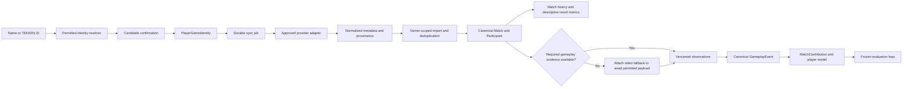

# Provider-neutral match ingestion / 1

Architecture addition for DojoPulse, updated 2026-09-19. Status: offline contracts, relational
cutover, synthetic imports and local linking/sync/history UI/API implemented. Network ingestion remains disabled.
Evidence: [source investigation](../research/tekken-match-sources.md).
Decision: [ADR-013](../adr/ADR-013-provider-neutral-match-ingestion.md).

## Product behavior

A player enters a display name or TEKKEN ID. An authorized resolver returns candidates with
source, stable identifier, character/platform context when available and observed-at time.
The player selects the correct profile, creating an owner-scoped PlayerGameIdentity link.
This is a claimed link until a supported verification method proves control; name/ID knowledge
alone is never login, account recovery, ownership proof or authorization to another user's data.

An explicit sync discovers available matches from permitted sources, previews import coverage,
and imports metadata without requiring a video. The history can show result, opponent,
character, time and source. Coaching requirements are evaluated separately: metadata-only
matches say additional gameplay evidence is needed. A compatible permitted event source can
eventually satisfy those requirements without video; otherwise attach a supported recording
to the existing match. No fabricated media object and no second match are created as a workaround.

Name search is a capability, not a universal promise. The currently documented EWGF public
API accepts TEKKEN ID, and Wavu's documented global feed is not efficient per-player discovery.
Until a permitted name resolver exists, use candidates from a consented/local identity index
or direct the player to retrieve their ID in-game. Do not scrape a private website route or
scan an entire global archive for every user keystroke.

## Trust classes and operation gates

| Access class | Meaning | Initial disposition |
|---|---|---|
| OFFICIAL | Publisher-authorized external interface/export with documented allowed usage | Reserved; no verified external Tekken API configured |
| COMMUNITY_PUBLIC_API | Maintainer-published third-party API | Wavu/EWGF candidates; network/commercial review pending |
| REVERSE_ENGINEERED | Undocumented game protocol, private web route, memory hook or unreviewed native integration | Disabled; explicit technical AND usage review required |
| USER_UPLOAD | Consented user-provided recording or permitted export | Existing trusted local video workflow |

Classification describes our access surface, not whether the source's underlying facts came
from the game. Preserve upstream lineage and licensing separately. Class alone grants no
operation: resolve-name, resolve-ID, list-matches, fetch-metadata, fetch-replay and decode-events
each require a reviewed capability, usage purpose, approval reference and expiry.
A purchased API tier or open-source code license does not silently approve product data rights.
Only USER_UPLOAD's current local video capability is enabled; no binary replay parser is implied.

## Data flow

Adapters have no ORM imports and do not create GameplayEvent, success counts, weak points
or improvement claims. The application service owns identity authorization, normalization
validation, deduplication, source retention and canonical publication.
A validated event decoder is a separate adapter stage from match-list retrieval.

## Logical schema and invariants

This section is the full target design. The local implementation now supports metadata-only
matches through migrations 0003/0004 and backend/core/match_ingestion.py. Identity alias tables,
production raw-snapshot storage, approved cross-provider merges and live adapters remain pending.

| Entity | Required fields / constraints |
|---|---|
| PlayerGameIdentity | UUID, owner/profile FK, game, canonical namespace + value, display label, state CLAIMED/VERIFIED/CONFLICT/REVOKED, linked_at, verification method/reference/time, consent scope, deleted_at |
| Identity binding | Within an identity, explicit namespace/value, provider, source assertion/hash, first/last observed timestamps and mapping method/version. Names are nonunique dated aliases; mapping conflicts require review. Use a child table when enforcing unique active bindings, not a universal ID string. |
| MatchSource | Provider registration key + immutable version, access class, upstream lineage, documentation/terms references, purpose-specific approvals, capability set, active state, credentials reference, rate policy and review expiry. A registry JSON is sufficient initially; never store secrets in it. |
| MatchSourceRecord | UUID, owner FK, Match FK, source/version, source-scoped external match ID, optional asserted upstream ID/namespace, retrieved_at, raw payload digest/private object reference, normalized revision/hash, schema/adapter version, coverage and correction state. Unique (owner, source, external ID, source revision). |
| ReplaySource | UUID, canonical Match FK, MatchSourceRecord FK or user-upload receipt, representation VIDEO/NATIVE_REPLAY/STRUCTURED_EVENTS, external replay ID (nullable), current availability, checked_at, upstream_expires_at (nullable), local_retain_until, content hash, ReplayAsset FK (nullable), raw/canonical build, parser version and compatibility. No public signed URLs persisted as stable IDs. |
| Sync state/job | owner + identity + source + query scope, opaque checkpoint, covered intervals and explicit gaps, last attempted/succeeded times, freshness/delay, lease/fence, attempts, next_attempt_at and stop reason. Unique active job/idempotency key; cursor commits atomically with imported batch. |

Do not make a table merely for each label: source policies are immutable versioned registry
documents initially; aliases/bindings and source records become relational where uniqueness,
joins or lifecycle demand it. A raw provider snapshot is private content-addressed storage,
not thousands of database rows per frame.

PlayerGameIdentity is an owner's link to one public game identity, not a global authenticated
account. Allow multiple platform/game identities; do not link them automatically. Opponents
are participant snapshots without DojoPulse accounts. Public IDs can be known by multiple
users; access always follows owner IDs, never possession of a Polaris ID.

A source external ID is unique only within its namespace. Same provider + same external ID
is idempotent; different providers' identical strings are not automatically identical matches.
Merge across providers only on a reviewed common upstream namespace plus matching participant,
time, mode and result assertions. Otherwise flag a probable duplicate for review. Two similar
rematches seconds apart must survive. Video hash deduplication proves identical bytes, not
identity with an independently encoded capture. Linking video requires reviewed match attribution.

Corrections append a source revision; they do not overwrite frozen event/evaluation facts.
A changed identity, result, game version or participant mapping invalidates dependent active
projections pending review. Display-name refresh alone is not a new played match.
Keep a canonical UUID stable across providers and added evidence.

## Canonical Match and events

Match represents a played contest, not an upload or an upstream replay-list row.
Implemented Match fields include game, nullable canonical build, raw version only on source records,
played_at with certainty, mode including unknown, owned player identity, participants, result
with certainty, lifecycle state and metadata revision. Session is nullable until a reviewed
sessionization policy supplies it; a feed page/time bucket is not an independent play session.

ReplayAsset is optional materialized evidence. ReplaySource links zero or more representations;
MatchSourceRecord links one or more metadata assertions. Match.asset is now optional and remains
the compatibility pointer for video analysis. Unknown canonical build, knowledge revision, character mapping,
duration and round timelines stay unknown. Never inherit upload defaults such as jin/jin or
infer knowledge revision from the current wall-clock date.

Metadata completeness, replay availability, evidence sufficiency and source coverage are
separate axes. METADATA_IMPORTED is successful ingestion, not failed analysis and not a
fully analyzed match. Distinguish AMBIGUOUS_IDENTITY, SYNC_PENDING, PARTIAL_HISTORY,
EVIDENCE_REQUIRED, REPLAY_EXPIRED and VERSION_UNSUPPORTED in the eventual UI.

GameplayEvent remains a source-neutral statement with evidence coordinates, actor identity,
clock, versions, unknown states and provenance. A future structured-event source passes
through the same rules and quality gates as video-derived observations. It cannot insert
a provider's rating, round win or input occurrence as a verified punish opportunity.

The existing Beta/Dirichlet player model consumes eligible canonical events only.
Match-result summaries get a distinct metric ID and denominator; never mix their win rates
with conditional response metrics. A source switch is a measurement change: pin source,
adapter, decoder and observation coverage in EvaluationPlan compatibility and test for
differential coverage before allowing comparison.

## Adapter contract

The executable contracts live in ingestion/contracts.py. Provider-neutral operations:

- resolve_player(query) -> candidate list, exact/ambiguous/not-supported outcome and provenance.
- discover_matches(identity, cursor, time range) -> metadata page, next cursor, observed
  coverage and gaps. The provider may not support this player-scoped operation.
- fetch_replay(reference) -> bytes/object receipt plus media kind, hash, expiration and build,
  or an explicit unsupported/expired/not-found/auth/schema error.
- decode_events(payload, reviewed decoder policy) is separate and gated; currently absent.

No arbitrary endpoint URL from the user or provider can be fetched. A future transport uses
an allowlisted base origin/path, validated opaque IDs, bounded redirects/decompression/bytes,
timeouts and a versioned response schema. Credential references stay server-side; tokens,
signed URLs, raw private bodies and full identity search strings are redacted from logs.
No PlayFab/game account login, cookie import or game-client signature emulation is implemented.

ingestion/wavu.py is a pure offline normalizer of the observed schema, not a network client.
Its output is metadata-only, preserves raw numeric codes, keeps IDs as strings, and never
claims a payload is downloadable. A version mapping is explicitly supplied and revisioned;
the default leaves canonical game_build unknown. Future EWGF parsing must use authenticated,
permitted fixtures from its live documented API rather than copied legacy DTO assumptions.

## Retry, rate, pagination and coverage policy

Use PostgreSQL durable jobs and existing lease/fence conventions; no new queue technology.
Retries belong to the acquisition stage, not to deterministic normalization/analysis.
Use one global provider quota per credential/origin across all workers, not one per player.
For Wavu, initially one in-flight request and at most 1 request/second, subject to approval;
for EWGF use the actual tier limits and reset headers. Concurrent syncs coalesce.

Persist Retry-After (seconds or HTTP date) as a not-before time. For 429 and retryable 5xx/
timeouts use capped exponential backoff with jitter, at most five automatic attempts and a
bounded elapsed budget. Never retry earlier than the provider's reset. Exhaustion moves the
job to attention-required, preserving the last successful checkpoint. No tight loops.

401/403 -> credentials/permission review, no alternate route or credential rotation.
400/schema drift/invalid identity -> permanent or quarantined until corrected.
404 -> unknown player/item for that source; do not infer deletion or another identity.
410 -> payload expired when the provider actually documents that meaning.
A network outage or subscription delay is not an empty match history.

For Wavu's approved feed traversal, query window boundaries using its exclusive lower and
inclusive upper time semantics, overlap modestly for late arrivals, and deduplicate by
battle ID. Advance even through a successfully verified empty time slice, but never through
failed/quarantined pages. A page over the resource cap is a recorded gap requiring a revised
strategy, not a reason to silently truncate. A global feed should be centrally cached once
only if terms allow, then matched against linked IDs; it is not fetched once per user.

For capped per-player APIs, track the oldest returned record, retrieval timestamp, delay and
whether history is truncated. If no cursor is documented, do not invent pagination or promise
backfill. Provider coverage windows are distinct from the actual user's complete play log.
Event-level coverage alone cannot repair a collector that missed unfavorable matches.

## Expiration, versioning and provenance

Separate remote existence (UNKNOWN/AVAILABLE/EXPIRED/NOT_FOUND), local retention and whether
a particular decoder/runtime can play the payload. Metadata can outlive native replay bytes.
A patch may invalidate downloaded payloads even while files still exist. Keep metadata
imported and mark the evidence unavailable; offer a previously recorded video fallback.

Store source raw version code, canonical build mapping revision and exact source assertion.
Do not arithmetically turn any integer into a trusted semantic game version. Same visible
version across platforms or hotfixes is not presumed replay-compatible.
Preserve old mappings/parser versions for reproduction; new knowledge produces a new analysis.

Provenance chain: source policy/approval -> request scope/retrieved time -> private snapshot
hash -> external record/revision -> normalization/mapping -> canonical match/participant ->
replay representation/decoder -> observations -> GameplayEvent -> contribution/evaluation.
A Wavu snapshot digest proves which metadata was read; it cannot substitute for the media
evidence hash in the current Opportunity contract.

Revocation/deletion stops syncs, fences late jobs, removes private identity bindings and
provider snapshots as required, and invalidates dependent conclusions. Metadata-only imports
need lifecycle deletion even without a ReplayAsset. Keep a minimal consent-compatible
suppression marker to prevent immediate re-import after a user's deletion; retention of such
a marker needs its own policy. Do not promise deletion from an upstream public database.

## Incremental implementation and activation

Local cutover completed 2026-09-19: two deterministic in-memory providers implement the same
adapter protocol. An explicitly selected, consented synthetic identity can start a fenced
PostgreSQL sync. Each bounded page commits metadata revisions, participant snapshots, coverage
and checkpoint atomically. Repeated records are idempotent; older conflicting assertions are
rejected. Protected gameplay facts are preserved on corrections, active contributions are
withdrawn and dependent conclusions invalidated pending review. Metadata alone creates no
GameplayEvent, ReplayAsset or AnalysisRun. Expired payload availability leaves metadata intact.

Local policy `synthetic-local/1` permits only synthetic-a/b with synthetic USER_UPLOAD provenance;
this is a fixture execution gate, not provider usage approval. No raw external snapshots are
stored by it. Source policies remain versioned documents. Each sync has at most five consecutive
failed attempts with a not-before time; live quota coordination remains pending activation.

Deletion currently uses conservative identity-wide suppression: removing a metadata-only match
revokes that identity's local sync consent and fences its jobs, removes the match's assertions,
participants and replay references, and leaves a deleted canonical UUID. Other imported matches
remain until separately deleted. Only the revoked namespaced link is retained for suppression
while the local account exists; relinking is blocked. Account deletion removes all identities,
sync state and source assertions. A narrower production suppression/retention policy is not
approved by this local mechanism. New video uploads dual-write USER_UPLOAD ReplaySource;
attaching a video to an imported match uses the local reviewed attribution workflow described
in [ADR-014](../adr/ADR-014-recording-attribution.md). Uploaded bytes remain pending until media
validation and operator attribution; gameplay publication requires separate annotation review.

The local UI/API confirms a provider candidate through a signed owner-bound token valid for
five minutes; client-submitted identity provenance and ownership claims are not accepted.
Session authentication, CSRF, private no-store responses and owner filters protect the flow.
HTTP queues the sync; `process_match_syncs` executes bounded pages separately, with schema
failures quarantined and acquisition failures delayed. DEBUG, LOCAL_MATCH_IMPORTS and active
staff status gate demo resolution/queuing/processing. Provider availability cannot be overridden
by submitting a URL or a disabled provider key. No network transport exists behind the flag.

History is paginated, includes upload-only records, preserves unknown build/character mappings,
and shows metadata and evidence sufficiency separately. Corrections awaiting review return an
unknown result. Coverage summarizes all committed pages conservatively so a later complete page
cannot hide an earlier gap. Refreshing a sync does not silently erase its recorded gaps.
Stopping sync preserves prior history and revokes the identity's import consent. Removing a
metadata-only match exposes the existing identity-wide revocation behavior before confirmation.
Source provenance and unavailable replay states remain visible in desktop and mobile layouts.

1. Done: research record, provider registry, ADR, logical model, typed DTO/
   protocol boundary, offline Wavu normalizer and synthetic tests. No live transport, identity
   ownership proof or native replay decoder is represented as complete.
2. Before automatic imports: approve a documented provider's concrete purpose/limits; obtain
   permitted live fixtures and an identity-resolution contract. Keep unsupported name lookup
   explicit. Prototype per-player history with EWGF's documented route if approved; assess
   Wavu feed cost/coverage/rights before any global collection.
3. DB cutover (implemented): add identity/source tables and nullable evidence relationship; backfill each
   existing upload with a USER_UPLOAD ReplaySource. Preserve UUIDs, event hashes and frozen
   memberships. Add owner/deletion checks for metadata-only records. Stop treating Match.asset
   as mandatory in publication, deletion, evaluation and API serialization.
4. Transactional metadata import (implemented for synthetic providers); test replayed pages, duplicates, corrections,
   ambiguity, cross-owner access, raw-version changes, expired evidence and late deletion.
   Local link/sync/history endpoints and ID confirmation UX are implemented; name lookup remains unsupported.
5. Enable non-video gameplay analysis only after a permitted payload/event source and reviewed
   decoder satisfy the same situation-level accuracy and timing gates. Otherwise video remains
   the evidence fallback for the measured training loop.

Acceptance: two fake providers produce the same canonical contract without downstream provider
branches; metadata-only matches create zero punish opportunities; names never select the first
candidate automatically; IDs do not lose precision; unsupported versions stay unknown; failed
pages do not advance cursors; expired payloads do not erase valid metadata; no frozen baseline
changes when another provider or a video is linked.
