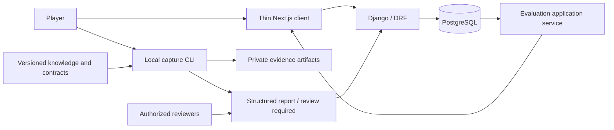

# System context

The CLI executes media work outside requests. The initial API manages local pilot metadata
and results, not arbitrary public media uploads. No running game process, third-party mod,
LLM or remote website is consulted during analysis. Owner and participant are separate identities.

## Provider-neutral acquisition extension

Future identity resolution and recent-match discovery are acquisition adapters outside the
canonical match/event/statistical core. User-uploaded video is one evidence representation.
Only reviewed sources may be called; undocumented game endpoints are not implemented.
Metadata can support history/results without a replay payload. See
[match ingestion](match-ingestion.md) for the flow, provider classes and staged DB cutover.

The implemented local flow adds session-authenticated player/history endpoints and a separate
`process_match_syncs` worker. Its two synthetic adapters exercise metadata acquisition without
external requests. Public providers are displayed as unavailable until their activation review
and technical integration are complete.
