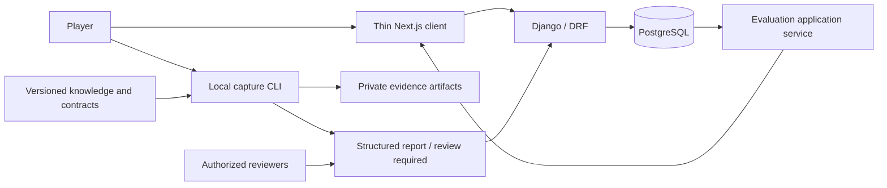

# System context

The CLI executes media work outside requests. The initial API manages local pilot metadata
and results, not arbitrary public media uploads. No running game process, third-party mod,
LLM or remote website is consulted during analysis. Owner and participant are separate identities.
